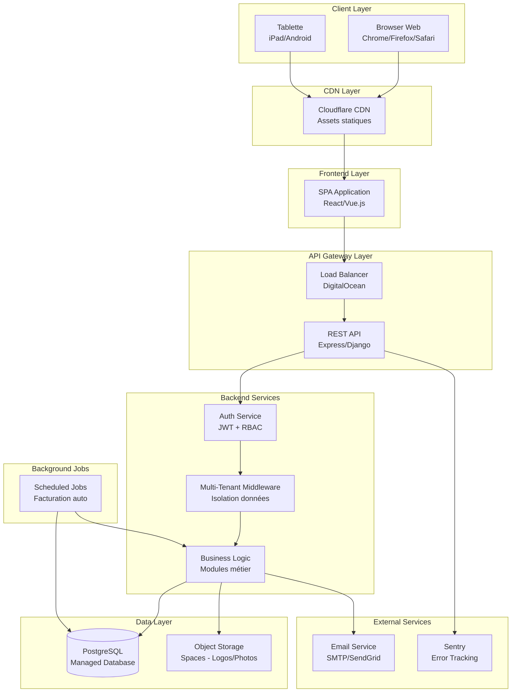
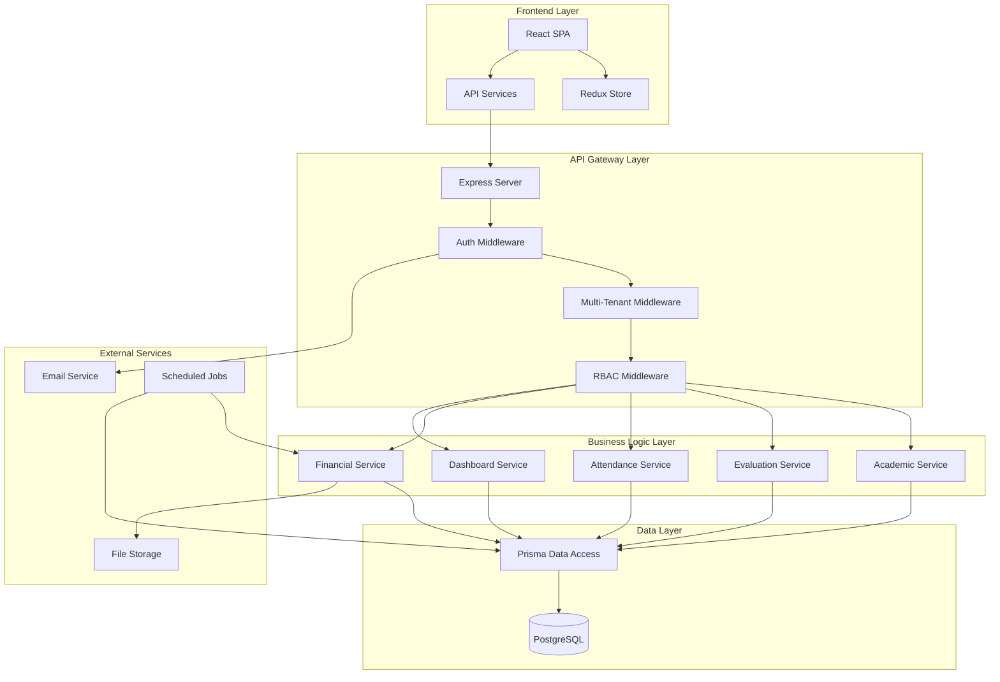
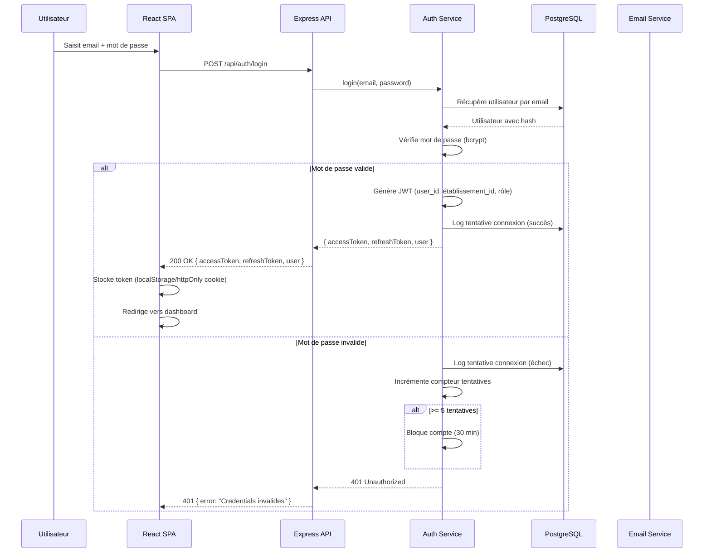
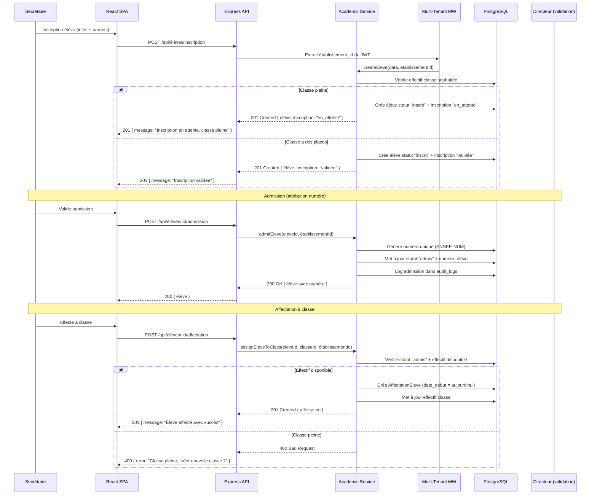
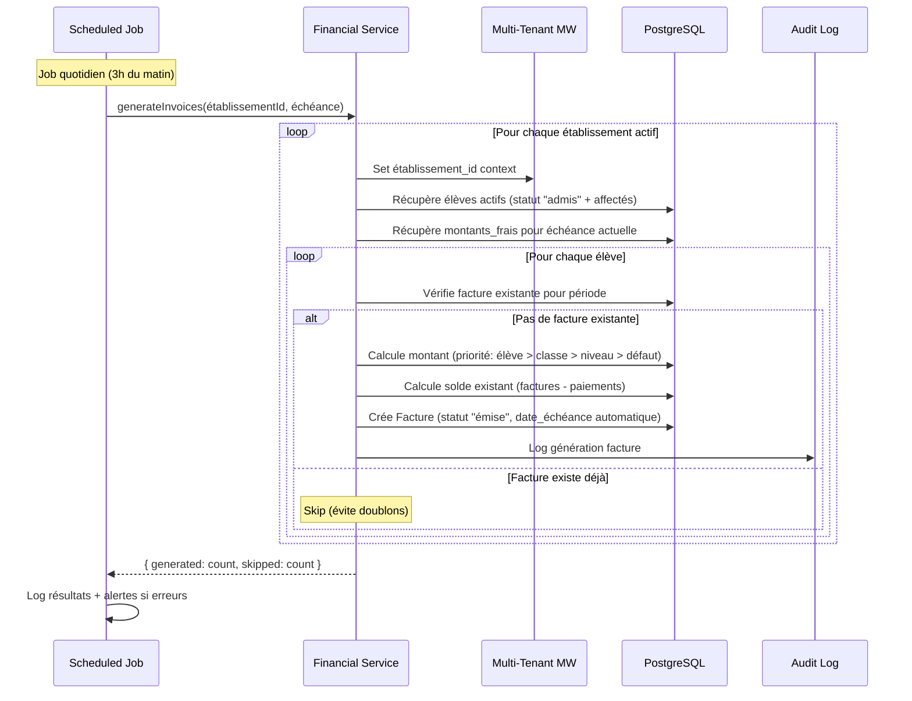
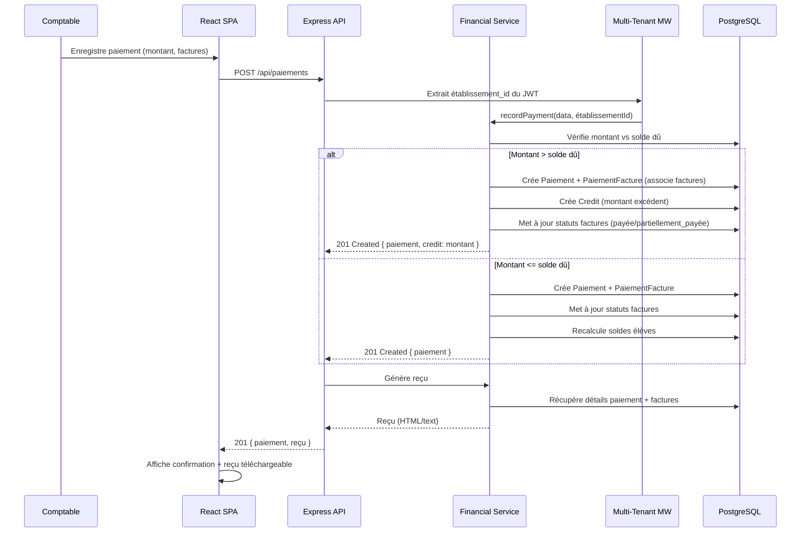
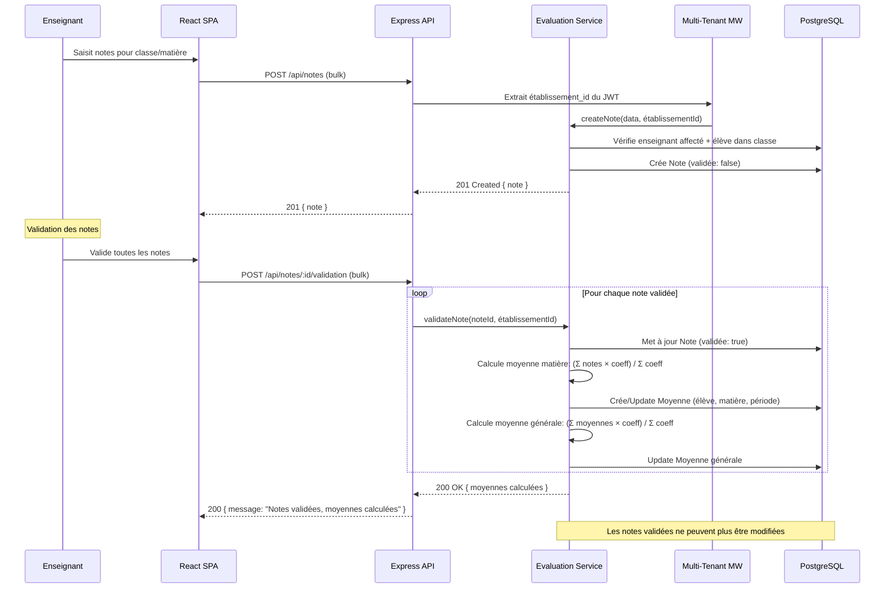

# SaaS de Gestion des Établissements Scolaires Fullstack Architecture Document

---

## Introduction

Ce document décrit l'architecture full-stack complète pour le SaaS de gestion des établissements scolaires, incluant les systèmes backend, l'implémentation frontend et leur intégration. Il sert de source unique de vérité pour le développement piloté par IA, garantissant la cohérence à travers toute la stack technologique.

Cette approche unifiée combine ce qui serait traditionnellement des documents d'architecture backend et frontend séparés, rationalisant le processus de développement pour les applications full-stack modernes où ces préoccupations sont de plus en plus entrelacées.

### Starter Template or Existing Project

**N/A - Greenfield project**

Ce projet est un projet greenfield sans template de démarrage existant. L'architecture sera conçue de zéro en suivant les meilleures pratiques pour une application SaaS multi-tenant avec les contraintes spécifiées dans le PRD (Monolith, Monorepo, PostgreSQL, stack Node.js/Express ou Python/Django avec React ou Vue.js).

### Change Log

| Date | Version | Description | Author |
|------|---------|-------------|--------|
| 2024 | 1.0 | Création initiale de l'architecture full-stack basée sur le PRD | Architect |

---

## High Level Architecture

### Technical Summary

Cette architecture full-stack implémente un SaaS multi-tenant pour la gestion d'établissements scolaires en utilisant une approche monolithique déployée sur une infrastructure cloud moderne. Le backend expose une API REST sécurisée avec authentification JWT et isolation stricte des données par établissement via un middleware de filtrage automatique. Le frontend est une Single Page Application (SPA) responsive qui communique avec l'API via Axios avec gestion centralisée de l'état et des erreurs. L'infrastructure utilise Docker pour la conteneurisation, PostgreSQL comme base de données principale avec index composites pour optimiser les requêtes multi-tenant, et un CDN pour accélérer le chargement des assets frontend (critique pour les connexions lentes en Afrique). Cette architecture atteint les objectifs du PRD en garantissant l'isolation des données entre établissements, la simplicité de déploiement pour le MVP, et une base évolutive pour les extensions futures.

### Platform and Infrastructure Choice

**Options considérées :**

1. **AWS Full Stack (EC2 + RDS + S3 + CloudFront)**
   - ✅ Contrôle total sur l'infrastructure
   - ✅ Services robustes et matures
   - ✅ Bonne scalabilité
   - ❌ Coût plus élevé pour MVP
   - ❌ Configuration plus complexe

2. **Vercel + Supabase**
   - ✅ Déploiement très simple
   - ✅ Excellent pour Next.js
   - ✅ Auth et storage intégrés
   - ❌ Moins de contrôle sur PostgreSQL
   - ❌ Coût peut augmenter rapidement

3. **DigitalOcean App Platform + Managed PostgreSQL**
   - ✅ Simplicité de déploiement
   - ✅ Coût prévisible et abordable
   - ✅ Bon pour MVP et croissance
   - ✅ Support Docker natif
   - ✅ CDN intégré
   - ✅ Régions disponibles en Afrique

**Recommandation : DigitalOcean App Platform + Managed PostgreSQL**

**Rationale :**
- Coût prévisible et abordable pour un MVP (critère important du PRD)
- Simplicité de déploiement avec Docker (aligné avec les choix techniques)
- Managed PostgreSQL avec sauvegardes automatiques (NFR13)
- CDN intégré pour optimiser les connexions lentes (NFR25)
- Support Docker natif pour conteneurisation
- Scalabilité progressive sans refonte majeure
- Régions disponibles pour réduire la latence en Afrique

**Platform:** DigitalOcean App Platform  
**Key Services:** App Platform (Docker), Managed PostgreSQL, Spaces (S3-compatible pour fichiers), CDN intégré, Load Balancer  
**Deployment Host and Regions:** Production en région Europe (Frankfurt) pour latence optimale, possibilité d'ajouter région Afrique (future)

### Repository Structure

**Structure:** Monorepo  
**Monorepo Tool:** npm workspaces (simplicité pour MVP, peut migrer vers Turborepo si nécessaire)  
**Package Organization:** 
- `apps/web` - Application frontend (React ou Vue.js)
- `apps/api` - Application backend (Node.js/Express ou Python/Django)
- `packages/shared` - Types TypeScript, constantes, utilitaires partagés
- `packages/ui` - Composants UI partagés (si nécessaire)
- `packages/config` - Configurations ESLint, TypeScript, Jest partagées

**Rationale :** Le PRD spécifie explicitement un Monorepo pour faciliter le partage de types/interfaces entre frontend et backend, la gestion centralisée des dépendances, et la synchronisation des versions. npm workspaces est suffisant pour le MVP et peut évoluer vers Turborepo si nécessaire pour optimiser les builds.

### High Level Architecture Diagram



### Architectural Patterns

- **Monolithic Architecture:** Application backend monolithique avec séparation claire des couches (API, Business Logic, Data Access) - _Rationale:_ Simplicité de déploiement, performance optimale sans latence réseau, développement rapide pour MVP, coût réduit. Le monolith peut être découpé en microservices plus tard si nécessaire.

- **Multi-Tenant Data Isolation Pattern:** Base de données partagée avec colonne `établissement_id` sur toutes les tables et middleware de filtrage automatique - _Rationale:_ Coût réduit par rapport à une base par tenant, maintenance simplifiée, isolation logique garantie au niveau application avec validation stricte API.

- **Component-Based UI Architecture:** Architecture frontend basée sur composants réutilisables avec TypeScript - _Rationale:_ Maintenabilité, réutilisabilité, type safety, aligné avec React/Vue.js modernes.

- **Repository Pattern:** Abstraction de la couche d'accès aux données avec interfaces TypeScript - _Rationale:_ Testabilité améliorée, flexibilité pour changement de base de données futur, séparation des responsabilités.

- **Middleware Pattern:** Chaîne de middlewares pour authentification, autorisation RBAC, et filtrage multi-tenant - _Rationale:_ Séparation claire des préoccupations transversales, réutilisabilité, facilité de test.

- **API Gateway Pattern:** Point d'entrée unique pour toutes les requêtes API avec Load Balancer - _Rationale:_ Centralisation de l'authentification, rate limiting, monitoring, et gestion d'erreurs.

- **State Management Pattern:** Gestion d'état centralisée avec Redux/Vuex pour état global (utilisateur, établissement actif, permissions) - _Rationale:_ Cohérence de l'état à travers l'application, facilité de débogage, prévisibilité.

- **Service Layer Pattern:** Couche de services entre controllers et repositories pour logique métier - _Rationale:_ Réutilisabilité de la logique métier, testabilité, séparation des responsabilités.

---

## Tech Stack

Cette section définit la sélection technologique DÉFINITIVE pour l'ensemble du projet. Tous les développements doivent utiliser ces versions exactes.

### Technology Stack Table

| Category | Technology | Version | Purpose | Rationale |
|----------|------------|---------|---------|-----------|
| Frontend Language | TypeScript | 5.3+ | Typage statique pour frontend | Type safety, meilleure DX, partage de types avec backend |
| Frontend Framework | React | 18.2+ | Framework UI principal | Écosystème mature, grande communauté, excellent support TypeScript, nombreuses bibliothèques |
| UI Component Library | Material-UI (MUI) | 5.14+ | Composants UI pré-construits | Composants professionnels, accessibilité WCAG AA intégrée, thème personnalisable |
| State Management | Redux Toolkit | 2.0+ | Gestion d'état global | Solution moderne Redux, moins de boilerplate, excellent DevTools, adapté pour multi-tenant |
| Routing | React Router | 6.20+ | Navigation SPA | Standard React, support TypeScript, lazy loading intégré |
| HTTP Client | Axios | 1.6+ | Client HTTP pour API | Intercepteurs pour JWT, gestion d'erreurs centralisée, timeout/retry configurable |
| CSS Framework | Emotion (via MUI) | 11.11+ | Styling CSS-in-JS | Intégré avec MUI, performant, support SSR |
| Backend Language | TypeScript | 5.3+ | Typage statique pour backend | Partage de types avec frontend, type safety, meilleure DX |
| Backend Framework | Node.js + Express | Node 20 LTS, Express 4.18+ | Framework backend | Écosystème npm riche, développement rapide, excellent pour APIs REST, partage TypeScript avec frontend |
| API Style | REST | - | Style d'API | Standard, simple, bien documenté, facile à tester |
| Database | PostgreSQL | 15+ | Base de données principale | Contraintes d'intégrité référentielle, transactions ACID, performance multi-tenant, JSON support |
| ORM | Prisma | 5.7+ | ORM et migrations | Type-safe, excellent pour multi-tenant, migrations automatiques, génération TypeScript |
| Cache | Redis | 7.2+ (optionnel MVP) | Cache et sessions | Performance, optionnel pour MVP mais recommandé pour scale |
| File Storage | DigitalOcean Spaces (S3-compatible) | - | Stockage fichiers (logos, photos) | Compatible S3, intégré DigitalOcean, CDN intégré |
| Authentication | jsonwebtoken + bcrypt | jwt 9.0+, bcrypt 5.1+ | Authentification JWT | Standard REST, stateless, adapté multi-tenant, bcrypt pour hashage mots de passe |
| Validation | Zod | 3.22+ | Validation schémas | Type-safe, TypeScript-first, meilleur que Joi pour TypeScript, partage frontend/backend |
| Frontend Testing | Jest + React Testing Library | Jest 29.7+, RTL 14.1+ | Tests frontend | Standard React, excellent support, tests de composants |
| Backend Testing | Jest + Supertest | Jest 29.7+, Supertest 6.3+ | Tests backend | Même stack que frontend, Supertest pour tests API |
| E2E Testing | Playwright | 1.40+ (Phase 2) | Tests end-to-end | Reporté Phase 2, meilleur que Cypress pour multi-navigateurs |
| Build Tool | Vite | 5.0+ | Build tool frontend | Rapide, HMR excellent, optimisé pour production |
| Bundler | Vite (intégré) | 5.0+ | Bundling frontend | Intégré avec Vite, optimisé, tree-shaking automatique |
| IaC Tool | Terraform | 1.6+ (optionnel MVP) | Infrastructure as Code | Optionnel pour MVP, recommandé pour production |
| CI/CD | GitHub Actions | - | Automatisation CI/CD | Intégré GitHub, gratuit, workflows flexibles |
| Monitoring | Sentry | - | Error tracking | SaaS simple pour MVP, excellent pour erreurs frontend/backend |
| Logging | Winston + Pino | Winston 3.11+, Pino 8.16+ | Logging structuré | Winston pour backend, Pino pour performance, logs structurés JSON |
| Package Manager | npm | 10+ | Gestion dépendances | Standard Node.js, workspaces natifs pour monorepo |

**Note sur les alternatives :** Le PRD mentionnait des alternatives (Python/Django pour backend, Vue.js pour frontend). Les choix ci-dessus sont recommandés pour optimiser le partage de types TypeScript entre frontend et backend, mais peuvent être ajustés selon l'expertise de l'équipe.

---

## Data Models

Les modèles de données suivants définissent les entités métier partagées entre frontend et backend. Toutes les interfaces TypeScript sont définies dans `packages/shared/src/types/` pour être réutilisées.

### Etablissement

**Purpose:** Représente un établissement scolaire dans le système multi-tenant. C'est l'entité racine pour l'isolation des données.

**Key Attributes:**
- `id`: UUID - Identifiant unique de l'établissement
- `nom`: string - Nom de l'établissement
- `type`: 'maternelle' | 'primaire' | 'secondaire' - Type d'établissement
- `adresse`: string | null - Adresse complète
- `téléphone`: string | null - Numéro de téléphone
- `email`: string | null - Email de contact
- `logo_url`: string | null - URL du logo (stocké dans Spaces)
- `actif`: boolean - Indique si l'établissement est actif
- `créé_le`: Date - Date de création
- `modifié_le`: Date - Date de dernière modification

**TypeScript Interface:**

```typescript
export enum TypeEtablissement {
  MATERNELLE = 'maternelle',
  PRIMAIRE = 'primaire',
  SECONDAIRE = 'secondaire',
}

export interface Etablissement {
  id: string;
  nom: string;
  type: TypeEtablissement;
  adresse: string | null;
  téléphone: string | null;
  email: string | null;
  logo_url: string | null;
  actif: boolean;
  créé_le: Date;
  modifié_le: Date;
}
```

**Relationships:**
- Un établissement a plusieurs utilisateurs (One-to-Many)
- Un établissement a plusieurs élèves (One-to-Many)
- Un établissement a plusieurs classes (One-to-Many)
- Toutes les autres entités référencent un établissement (établissement_id)

### Utilisateur

**Purpose:** Représente un utilisateur du système avec authentification et rôles RBAC.

**Key Attributes:**
- `id`: UUID - Identifiant unique
- `email`: string - Email unique (utilisé pour authentification)
- `mot_de_passe_hash`: string - Hash bcrypt du mot de passe
- `établissement_id`: UUID - Référence à l'établissement
- `rôle`: RoleEnum - Rôle RBAC (Directeur, Admin, Secrétaire, Comptable, Enseignant)
- `actif`: boolean - Soft delete flag
- `créé_le`: Date - Date de création

**TypeScript Interface:**

```typescript
export enum Role {
  DIRECTEUR = 'directeur',
  ADMIN = 'admin',
  SECRETAIRE = 'secrétaire',
  COMPTABLE = 'comptable',
  ENSEIGNANT = 'enseignant',
}

export interface Utilisateur {
  id: string;
  email: string;
  mot_de_passe_hash: string;
  établissement_id: string;
  rôle: Role;
  actif: boolean;
  créé_le: Date;
}
```

**Relationships:**
- Un utilisateur appartient à un établissement (Many-to-One avec Etablissement)
- Un utilisateur peut être lié à un enseignant (One-to-One optionnel)

### Eleve

**Purpose:** Représente un élève dans le système avec cycle de vie (inscrit → admis → désinscrit).

**Key Attributes:**
- `id`: UUID - Identifiant unique
- `numéro_élève`: string | null - Numéro unique format ANNEE-NUM (généré à l'admission)
- `nom`: string - Nom de famille
- `prénom`: string - Prénom
- `date_naissance`: Date - Date de naissance
- `sexe`: 'M' | 'F' | 'Autre' - Sexe de l'élève
- `photo_url`: string | null - URL de la photo (stockée dans Spaces)
- `statut`: StatutEleve - Statut: inscrit, admis, désinscrit
- `établissement_id`: UUID - Référence à l'établissement
- `créé_le`: Date - Date de création

**TypeScript Interface:**

```typescript
export enum StatutEleve {
  INSCRIT = 'inscrit',
  ADMIS = 'admis',
  DESINSCRIT = 'désinscrit',
}

export enum Sexe {
  M = 'M',
  F = 'F',
  AUTRE = 'Autre',
}

export interface Eleve {
  id: string;
  numéro_élève: string | null;
  nom: string;
  prénom: string;
  date_naissance: Date;
  sexe: Sexe;
  photo_url: string | null;
  statut: StatutEleve;
  établissement_id: string;
  créé_le: Date;
}
```

**Relationships:**
- Un élève appartient à un établissement (Many-to-One)
- Un élève a un ou plusieurs parents (One-to-Many avec Parent)
- Un élève peut avoir plusieurs affectations à des classes (One-to-Many avec AffectationEleve)
- Un élève a plusieurs notes (One-to-Many avec Note)
- Un élève a plusieurs présences (One-to-Many avec Presence)
- Un élève a plusieurs factures (One-to-Many avec Facture)

### Parent

**Purpose:** Représente les informations des parents/tuteurs d'un élève.

**Key Attributes:**
- `id`: UUID - Identifiant unique
- `élève_id`: UUID - Référence à l'élève
- `nom`: string - Nom complet
- `téléphone`: string | null - Numéro de téléphone
- `email`: string | null - Email
- `adresse`: string | null - Adresse complète
- `établissement_id`: UUID - Référence à l'établissement

**TypeScript Interface:**

```typescript
export interface Parent {
  id: string;
  élève_id: string;
  nom: string;
  téléphone: string | null;
  email: string | null;
  adresse: string | null;
  établissement_id: string;
}
```

**Relationships:**
- Un parent appartient à un élève (Many-to-One avec Eleve)
- Un élève peut avoir plusieurs parents (One-to-Many)

### Classe

**Purpose:** Représente une classe avec capacité maximale et gestion des effectifs.

**Key Attributes:**
- `id`: UUID - Identifiant unique
- `nom`: string - Nom de la classe (unique par établissement et année)
- `niveau`: string - Niveau scolaire (ex: CP, CE1, 6ème, etc.)
- `effectif_max`: number - Capacité maximale d'élèves
- `établissement_id`: UUID - Référence à l'établissement
- `année_scolaire_id`: UUID - Référence à l'année scolaire active
- `créé_le`: Date - Date de création

**TypeScript Interface:**

```typescript
export interface Classe {
  id: string;
  nom: string;
  niveau: string;
  effectif_max: number;
  établissement_id: string;
  année_scolaire_id: string;
  créé_le: Date;
}
```

**Relationships:**
- Une classe appartient à un établissement (Many-to-One)
- Une classe appartient à une année scolaire (Many-to-One avec AnneeScolaire)
- Une classe a plusieurs élèves via AffectationEleve (One-to-Many)
- Une classe a plusieurs enseignants via AffectationEnseignant (Many-to-Many)

### Enseignant

**Purpose:** Représente un enseignant de l'établissement avec affectations aux classes.

**Key Attributes:**
- `id`: UUID - Identifiant unique
- `nom`: string - Nom de famille
- `prénom`: string - Prénom
- `email`: string | null - Email de contact
- `téléphone`: string | null - Numéro de téléphone
- `établissement_id`: UUID - Référence à l'établissement
- `créé_le`: Date - Date de création

**TypeScript Interface:**

```typescript
export interface Enseignant {
  id: string;
  nom: string;
  prénom: string;
  email: string | null;
  téléphone: string | null;
  établissement_id: string;
  créé_le: Date;
}
```

**Relationships:**
- Un enseignant appartient à un établissement (Many-to-One)
- Un enseignant a plusieurs affectations via AffectationEnseignant (One-to-Many)
- Un enseignant peut être lié à un utilisateur (One-to-One optionnel)

### Note

**Purpose:** Représente une note numérique pour un élève dans une matière et une période.

**Key Attributes:**
- `id`: UUID - Identifiant unique
- `élève_id`: UUID - Référence à l'élève
- `matière_id`: UUID - Référence à la matière
- `période_id`: UUID - Référence à la période
- `note`: number - Note obtenue
- `note_max`: number - Note maximale possible
- `coefficient`: number - Coefficient pour calcul de moyenne
- `validée`: boolean - Indique si la note est validée (non modifiable)
- `établissement_id`: UUID - Référence à l'établissement
- `créé_le`: Date - Date de création

**TypeScript Interface:**

```typescript
export interface Note {
  id: string;
  élève_id: string;
  matière_id: string;
  période_id: string;
  note: number;
  note_max: number;
  coefficient: number;
  validée: boolean;
  établissement_id: string;
  créé_le: Date;
}
```

**Relationships:**
- Une note appartient à un élève (Many-to-One)
- Une note appartient à une matière (Many-to-One)
- Une note appartient à une période (Many-to-One)
- Une note peut avoir une évaluation de rattrapage (One-to-One optionnel)

### Facture

**Purpose:** Représente une facture générée pour un élève avec statut de paiement.

**Key Attributes:**
- `id`: UUID - Identifiant unique
- `élève_id`: UUID - Référence à l'élève
- `type_frais_id`: UUID - Référence au type de frais
- `montant`: number - Montant de la facture (DECIMAL en DB)
- `date_émission`: Date - Date d'émission
- `date_échéance`: Date - Date d'échéance
- `statut`: StatutFacture - Statut: émise, payée, partiellement_payée, impayée
- `période`: string - Période facturée (ex: "Janvier 2024")
- `établissement_id`: UUID - Référence à l'établissement
- `créé_le`: Date - Date de création

**TypeScript Interface:**

```typescript
export enum StatutFacture {
  EMISE = 'émise',
  PAYEE = 'payée',
  PARTIELLEMENT_PAYEE = 'partiellement_payée',
  IMPAYEE = 'impayée',
}

export interface Facture {
  id: string;
  élève_id: string;
  type_frais_id: string;
  montant: number;
  date_émission: Date;
  date_échéance: Date;
  statut: StatutFacture;
  période: string;
  établissement_id: string;
  créé_le: Date;
}
```

**Relationships:**
- Une facture appartient à un élève (Many-to-One)
- Une facture appartient à un type de frais (Many-to-One)
- Une facture a plusieurs paiements via PaiementFacture (Many-to-Many)

### Modèles de données supplémentaires

**Les modèles suivants sont également nécessaires et suivent le même pattern :**

- **AnneeScolaire:** Année scolaire active par établissement (id, nom, date_début, date_fin, établissement_id, active)
- **Periode:** Périodes académiques (trimestres) (id, nom, date_début, date_fin, année_scolaire_id, établissement_id)
- **Matiere:** Matières enseignées avec coefficients (id, nom, niveau, coefficient, établissement_id)
- **AffectationEleve:** Affectation élève à classe avec dates (id, élève_id, classe_id, date_début, date_fin, établissement_id)
- **AffectationEnseignant:** Affectation enseignant à classe/matière (id, enseignant_id, classe_id, matière_id, date_début, date_fin, établissement_id)
- **Inscription:** Inscriptions avec liste d'attente (id, élève_id, classe_souhaitée_id, statut, établissement_id)
- **Presence:** Présences quotidiennes (id, élève_id, classe_id, date, présent, établissement_id)
- **Moyenne:** Moyennes calculées par élève/matière/période (id, élève_id, matière_id, période_id, moyenne, établissement_id)
- **EvaluationQualitative:** Évaluations qualitatives maternelle (id, élève_id, domaine, valeur, période_id, établissement_id)
- **EvaluationRattrapage:** Rattrapages programmés (id, note_originale_id, date_limite, note_rattrapage, établissement_id)
- **TypeFrais:** Types de frais configurables (id, nom, description, établissement_id)
- **MontantFrais:** Montants de frais par niveau/classe/élève (id, type_frais_id, niveau_id, classe_id, élève_id, montant, échéance, établissement_id)
- **Paiement:** Paiements enregistrés (id, élève_id, montant, date, mode, établissement_id)
- **PaiementFacture:** Relation many-to-many paiements-factures (id, paiement_id, facture_id, montant_affecté)
- **Credit:** Crédits (paiements en avance) (id, élève_id, montant, solde_restant, établissement_id)
- **AuditLog:** Logs d'audit (id, utilisateur_id, établissement_id, action, ressource, données_avant, données_après, timestamp, ip, user_agent)

**Note:** Tous ces modèles incluent `établissement_id` pour l'isolation multi-tenant et suivent le même pattern TypeScript avec interfaces partagées dans `packages/shared/src/types/`.

---

## API Specification

### REST API Specification

L'API REST suit les principes RESTful standards avec endpoints organisés par ressources. Tous les endpoints (sauf `/api/auth/*`) nécessitent une authentification JWT avec `établissement_id` dans le token pour l'isolation multi-tenant automatique.

```yaml
openapi: 3.0.0
info:
  title: SaaS Gestion Scolaire API
  version: 1.0.0
  description: |
    API REST pour le système de gestion d'établissements scolaires.
    Architecture multi-tenant avec isolation stricte des données par établissement.
    
    **Authentification:** Tous les endpoints (sauf /auth/*) nécessitent un JWT dans le header Authorization.
    **Isolation Multi-Tenant:** Toutes les requêtes sont automatiquement filtrées par établissement_id extrait du JWT.
    **Pagination:** Toutes les listes sont paginées (limite par défaut: 50, max: 100).
    **Validation:** Toutes les données d'entrée sont validées avec Zod.
    
servers:
  - url: https://api.example.com/api
    description: Production
  - url: https://staging-api.example.com/api
    description: Staging
  - url: http://localhost:3000/api
    description: Local Development

tags:
  - name: Authentication
    description: Endpoints d'authentification (publics)
  - name: Etablissements
    description: Gestion des établissements scolaires
  - name: Utilisateurs
    description: Gestion des utilisateurs et rôles
  - name: Eleves
    description: Gestion des élèves et inscriptions
  - name: Classes
    description: Gestion des classes
  - name: Enseignants
    description: Gestion des enseignants
  - name: Evaluations
    description: Gestion des notes et évaluations
  - name: Presence
    description: Prise de présence
  - name: Financier
    description: Gestion financière (factures, paiements)
  - name: Dashboard
    description: Tableaux de bord et statistiques
  - name: Exports
    description: Exports de données

security:
  - bearerAuth: []

components:
  securitySchemes:
    bearerAuth:
      type: http
      scheme: bearer
      bearerFormat: JWT
      description: |
        JWT token obtenu via /api/auth/login.
        Le token contient: user_id, établissement_id, rôle.
        Durée de validité: 24 heures.
        
  schemas:
    Error:
      type: object
      properties:
        error:
          type: object
          properties:
            code:
              type: string
              example: "VALIDATION_ERROR"
            message:
              type: string
              example: "Les données fournies sont invalides"
            details:
              type: object
              additionalProperties: true
            timestamp:
              type: string
              format: date-time
            requestId:
              type: string
              format: uuid
      required:
        - error
        
    PaginatedResponse:
      type: object
      properties:
        data:
          type: array
        pagination:
          type: object
          properties:
            page:
              type: integer
            limit:
              type: integer
            total:
              type: integer
            totalPages:
              type: integer
      required:
        - data
        - pagination
```

**Endpoints principaux par module :**

**Authentication (public):**
- `POST /api/auth/login` - Connexion avec email/mot de passe
- `POST /api/auth/refresh` - Renouveler le token
- `POST /api/auth/logout` - Déconnexion
- `POST /api/auth/forgot-password` - Demande de réinitialisation
- `POST /api/auth/reset-password` - Réinitialiser avec token

**Etablissements:**
- `POST /api/établissements` - Créer un établissement
- `GET /api/établissements/:id` - Détails d'un établissement
- `PUT /api/établissements/:id` - Modifier un établissement
- `GET /api/établissements` - Lister (admin système uniquement)

**Utilisateurs:**
- `POST /api/utilisateurs` - Créer un utilisateur (Directeur/Admin)
- `GET /api/utilisateurs` - Lister les utilisateurs de l'établissement
- `GET /api/utilisateurs/:id` - Détails d'un utilisateur
- `PUT /api/utilisateurs/:id` - Modifier un utilisateur
- `DELETE /api/utilisateurs/:id` - Désactiver (soft delete)

**Eleves:**
- `POST /api/élèves/inscription` - Inscrire un nouvel élève
- `GET /api/élèves` - Lister avec filtres (statut, classe, recherche)
- `GET /api/élèves/:id` - Détails complets d'un élève
- `PUT /api/élèves/:id` - Modifier un élève
- `POST /api/élèves/:id/admission` - Valider admission et attribuer numéro
- `POST /api/élèves/:id/affectation` - Affecter à une classe
- `POST /api/élèves/:id/transfert` - Transférer vers une autre classe
- `POST /api/élèves/:id/désinscription` - Désinscrire (vérifie solde)

**Classes:**
- `POST /api/classes` - Créer une classe
- `GET /api/classes` - Lister avec effectifs
- `GET /api/classes/:id` - Détails d'une classe
- `PUT /api/classes/:id` - Modifier une classe
- `GET /api/classes/:id/élèves` - Liste des élèves d'une classe
- `GET /api/classes/:id/enseignants` - Liste des enseignants

**Enseignants:**
- `POST /api/enseignants` - Créer un enseignant
- `GET /api/enseignants` - Lister avec recherche/filtres
- `GET /api/enseignants/:id` - Détails d'un enseignant
- `PUT /api/enseignants/:id` - Modifier
- `DELETE /api/enseignants/:id` - Supprimer (soft delete)
- `POST /api/enseignants/:id/affectation` - Affecter à classe/matière

**Evaluations:**
- `POST /api/notes` - Saisir une note
- `GET /api/classes/:id/notes` - Notes d'une classe par matière
- `GET /api/élèves/:id/notes` - Notes d'un élève
- `POST /api/notes/:id/validation` - Valider une note (bloque modification)
- `POST /api/notes/absence` - Gérer absence de note
- `POST /api/notes/:id/rattrapage` - Programmer rattrapage
- `POST /api/évaluations-qualitatives` - Saisir évaluation qualitative (maternelle)
- `GET /api/élèves/:id/moyennes` - Moyennes d'un élève
- `GET /api/élèves/:id/bulletin/:période_id` - Générer bulletin

**Presence:**
- `POST /api/présences` - Enregistrer présences d'une classe pour une date
- `GET /api/classes/:id/présences/:date` - Présences d'une classe à une date
- `GET /api/classes/:id/absents/:date` - Liste des absents
- `GET /api/élèves/:id/statistiques-présence` - Stats d'un élève

**Financier:**
- `POST /api/types-frais` - Créer type de frais
- `GET /api/types-frais` - Lister types de frais
- `POST /api/montants-frais` - Configurer montant de frais
- `POST /api/factures/génération-automatique` - Générer factures automatiquement
- `POST /api/factures` - Générer facture manuelle
- `GET /api/factures` - Lister avec filtres (élève, statut, période)
- `GET /api/factures/:id` - Détails d'une facture
- `PUT /api/factures/:id` - Modifier (si statut "émise")
- `GET /api/factures/impayées` - Liste des factures impayées
- `POST /api/paiements` - Enregistrer un paiement
- `GET /api/paiements` - Lister paiements
- `GET /api/paiements/:id/reçu` - Générer reçu
- `GET /api/élèves/:id/solde` - Solde d'un élève
- `GET /api/élèves/:id/crédits` - Crédits d'un élève
- `GET /api/rapports/recettes` - Rapports de recettes
- `GET /api/rapports/statistiques` - Statistiques financières

**Dashboard:**
- `GET /api/dashboard` - Données du tableau de bord (adapté par rôle)
- `GET /api/dashboard/alertes` - Alertes (impayés, absences, etc.)

**Exports:**
- `GET /api/export/élèves` - Export Excel liste élèves
- `GET /api/export/paiements` - Export Excel liste paiements
- `GET /api/export/factures` - Export Excel liste factures

**Patterns d'endpoints :**
- **Authentification:** Bearer JWT dans header `Authorization: Bearer <token>`
- **Pagination:** Query params `?page=1&limit=50` (max 100)
- **Filtres:** Query params `?statut=admis&classe_id=xxx`
- **Recherche:** Query param `?search=nom` pour recherche textuelle
- **Tri:** Query param `?sort=nom&order=asc`
- **Erreurs:** Format standardisé avec code, message, details
- **Isolation:** Toutes les requêtes filtrées automatiquement par `établissement_id` du JWT

---

## Components

Cette section identifie les composants logiques majeurs à travers la fullstack, leurs responsabilités, interfaces, dépendances et technologies.

### Frontend Application (React SPA)

**Responsibility:** Interface utilisateur complète avec navigation, gestion d'état, et communication avec l'API backend.

**Key Interfaces:**
- Routes React Router pour navigation SPA avec lazy loading
- Composants UI réutilisables (Material-UI)
- Services API pour communication avec backend (Axios)
- Store Redux Toolkit pour état global (utilisateur, établissement, permissions)
- Hooks personnalisés pour logique réutilisable
- Gestion d'erreurs centralisée avec intercepteurs Axios
- Authentification JWT avec refresh tokens
- Protection de routes basée sur RBAC

**Dependencies:**
- API Backend (toutes les fonctionnalités)
- Services externes (email pour notifications, stockage pour uploads)

**Technology Stack:** React 18.2+, TypeScript 5.3+, Material-UI 5.14+, Redux Toolkit 2.0+, React Router 6.20+, Axios 1.6+, Vite 5.0+

#### Frontend Directory Structure

```
apps/web/
├── src/
│   ├── components/          # Composants réutilisables
│   │   ├── common/          # Composants communs (Button, Input, etc.)
│   │   ├── layout/          # Layout components (Header, Sidebar, etc.)
│   │   └── forms/           # Composants de formulaires réutilisables
│   ├── features/            # Features organisées par module métier
│   │   ├── auth/            # Authentification (Login, ResetPassword)
│   │   ├── dashboard/       # Tableaux de bord
│   │   ├── élèves/          # Gestion des élèves
│   │   ├── classes/         # Gestion des classes
│   │   ├── enseignants/     # Gestion des enseignants
│   │   ├── evaluations/     # Saisie de notes, évaluations
│   │   ├── presence/        # Prise de présence
│   │   ├── financier/       # Factures, paiements, configuration frais
│   │   ├── utilisateurs/    # Gestion des utilisateurs
│   │   └── établissements/  # Configuration établissement
│   ├── pages/               # Pages/pages composées (si nécessaire)
│   ├── store/               # Redux store configuration
│   │   ├── slices/          # Redux slices (authSlice, élèvesSlice, etc.)
│   │   └── store.ts         # Store configuration
│   ├── services/            # Services API (Axios clients)
│   │   ├── api/             # Clients API par module
│   │   │   ├── auth.api.ts
│   │   │   ├── élèves.api.ts
│   │   │   ├── classes.api.ts
│   │   │   ├── evaluations.api.ts
│   │   │   ├── financier.api.ts
│   │   │   └── ...
│   │   ├── axios.ts         # Configuration Axios (intercepteurs, base URL)
│   │   └── types.ts         # Types pour les réponses API
│   ├── hooks/               # Hooks personnalisés
│   │   ├── useAuth.ts       # Hook d'authentification
│   │   ├── usePermissions.ts # Hook de permissions RBAC
│   │   ├── useApi.ts        # Hook générique pour appels API
│   │   └── ...
│   ├── utils/               # Utilitaires
│   │   ├── validation.ts    # Fonctions de validation
│   │   ├── formatters.ts    # Formatage de données
│   │   ├── constants.ts     # Constantes partagées
│   │   └── ...
│   ├── routes/              # Configuration de routing
│   │   ├── AppRoutes.tsx    # Routes principales
│   │   ├── ProtectedRoute.tsx # Route protégée par authentification
│   │   └── RoleRoute.tsx    # Route protégée par rôle
│   ├── theme/               # Configuration Material-UI theme
│   │   └── theme.ts
│   ├── App.tsx              # Composant racine
│   └── main.tsx             # Point d'entrée
├── public/                  # Assets statiques
├── package.json
├── tsconfig.json
├── vite.config.ts
└── ...
```

**Rationale:** Organisation par features pour faciliter la maintenance et le développement parallèle. Séparation claire entre composants réutilisables, features métier, services API, et logique d'état.

#### Routing Architecture

**Routing Strategy:** React Router v6 avec lazy loading pour optimiser le chargement initial et le code splitting par route.

**Route Structure:**
- `/login` - Page de connexion (publique)
- `/forgot-password` - Réinitialisation mot de passe (publique)
- `/reset-password/:token` - Reset avec token (publique)
- `/dashboard` - Tableau de bord (protégée, adaptée par rôle)
- `/élèves` - Liste des élèves (protégée, rôles: Directeur, Admin, Secrétaire)
- `/élèves/:id` - Fiche élève (protégée, rôles: Directeur, Admin, Secrétaire)
- `/élèves/inscription` - Formulaire d'inscription (protégée, rôles: Secrétaire)
- `/élèves/:id/admission` - Admission d'un élève (protégée, rôles: Directeur, Secrétaire)
- `/classes` - Liste des classes (protégée, tous rôles)
- `/classes/:id` - Détails classe (protégée, tous rôles)
- `/classes/:id/élèves` - Élèves d'une classe (protégée, tous rôles)
- `/enseignants` - Liste des enseignants (protégée, rôles: Directeur, Admin)
- `/enseignants/:id` - Fiche enseignant (protégée, rôles: Directeur, Admin)
- `/evaluations` - Saisie de notes (protégée, rôles: Enseignant, Directeur, Admin)
- `/evaluations/classes/:id` - Notes d'une classe (protégée, rôles: Enseignant, Directeur, Admin)
- `/presence` - Prise de présence (protégée, rôles: Enseignant, Directeur, Admin)
- `/presence/classes/:id` - Présences d'une classe (protégée, rôles: Enseignant, Directeur, Admin)
- `/financier/factures` - Liste des factures (protégée, rôles: Directeur, Admin, Comptable)
- `/financier/factures/:id` - Détails facture (protégée, rôles: Directeur, Admin, Comptable)
- `/financier/paiements` - Enregistrement paiements (protégée, rôles: Directeur, Admin, Comptable)
- `/financier/configuration` - Configuration frais (protégée, rôles: Directeur, Admin, Comptable)
- `/utilisateurs` - Gestion utilisateurs (protégée, rôles: Directeur, Admin)
- `/établissement` - Configuration établissement (protégée, rôles: Directeur, Admin)

**Route Protection:**
- `ProtectedRoute` composant qui vérifie l'authentification (JWT valide)
- `RoleRoute` composant qui vérifie le rôle utilisateur avant d'afficher la route
- Redirection automatique vers `/login` si non authentifié
- Redirection vers `/dashboard` si accès non autorisé (403)

**Lazy Loading:** Toutes les routes de features sont chargées en lazy avec `React.lazy()` et `Suspense` pour optimiser le bundle initial.

#### State Management (Redux Toolkit)

**Store Structure:**

```typescript
{
  auth: {
    user: User | null;
    token: string | null;
    refreshToken: string | null;
    isAuthenticated: boolean;
    loading: boolean;
  };
  établissement: {
    current: Etablissement | null;
    loading: boolean;
  };
  permissions: {
    userRole: Role | null;
    permissions: Permission[];
  };
  élèves: {
    list: Eleve[];
    selected: Eleve | null;
    filters: EleveFilters;
    pagination: Pagination;
    loading: boolean;
  };
  classes: {
    list: Classe[];
    selected: Classe | null;
    loading: boolean;
  };
  evaluations: {
    notes: Note[];
    loading: boolean;
  };
  financier: {
    factures: Facture[];
    paiements: Paiement[];
    loading: boolean;
  };
  ui: {
    sidebarOpen: boolean;
    notifications: Notification[];
    errors: Error[];
  };
}
```

**Redux Slices:**
- `authSlice` - Authentification, token management
- `établissementSlice` - Établissement actif
- `permissionsSlice` - Permissions RBAC
- `élèvesSlice` - État des élèves (liste, sélectionné, filtres)
- `classesSlice` - État des classes
- `evaluationsSlice` - État des évaluations
- `financierSlice` - État financier
- `uiSlice` - État UI (sidebar, notifications, erreurs)

**Async Actions:** Utilisation de `createAsyncThunk` pour les appels API avec gestion automatique des états loading/error/success.

#### API Services Layer

**Axios Configuration:**
- Base URL configurée via variable d'environnement (`VITE_API_URL`)
- Intercepteur de requête : Ajout automatique du token JWT dans header `Authorization: Bearer <token>`
- Intercepteur de réponse : Gestion des erreurs 401 (refresh token), 403 (redirection), erreurs réseau
- Timeout configuré (30 secondes pour connexions lentes)
- Retry logic pour erreurs réseau temporaires (max 3 tentatives)

**Service Organization:**
Chaque module métier a son service API dédié :
- `auth.api.ts` - Endpoints d'authentification
- `élèves.api.ts` - Endpoints élèves (CRUD, admission, affectation)
- `classes.api.ts` - Endpoints classes
- `enseignants.api.ts` - Endpoints enseignants
- `evaluations.api.ts` - Endpoints notes et évaluations
- `presence.api.ts` - Endpoints présences
- `financier.api.ts` - Endpoints factures, paiements, configuration
- `utilisateurs.api.ts` - Endpoints utilisateurs
- `établissements.api.ts` - Endpoints établissements
- `dashboard.api.ts` - Endpoints tableau de bord
- `exports.api.ts` - Endpoints exports Excel

**Type Safety:** Tous les services utilisent les types TypeScript partagés depuis `packages/shared/src/types/` pour garantir la cohérence avec le backend.

#### Component Architecture

**Component Hierarchy:**
```
App
├── ThemeProvider (MUI Theme)
├── ReduxProvider
├── Router
│   ├── AuthRoutes (publiques)
│   │   ├── LoginPage
│   │   ├── ForgotPasswordPage
│   │   └── ResetPasswordPage
│   └── ProtectedRoutes
│       ├── Layout (Header + Sidebar + Content)
│       │   ├── DashboardPage
│       │   ├── ÉlèvesFeature
│       │   │   ├── ÉlèvesListPage
│       │   │   ├── ÉlèveDetailPage
│       │   │   └── ÉlèveInscriptionPage
│       │   ├── ClassesFeature
│       │   ├── EvaluationsFeature
│       │   ├── FinancierFeature
│       │   └── ...
│       └── ErrorBoundary
```

**Reusable Components (Material-UI based):**
- `DataTable` - Tableau de données avec pagination, tri, filtres
- `FormField` - Champ de formulaire avec validation et erreurs
- `ConfirmDialog` - Dialog de confirmation pour actions critiques
- `StatusBadge` - Badge pour afficher les statuts (admis, payé, etc.)
- `FileUpload` - Composant d'upload avec preview pour logos/photos
- `SearchBar` - Barre de recherche avec debounce
- `FilterPanel` - Panneau de filtres collapsible
- `LoadingSpinner` - Indicateur de chargement
- `ErrorDisplay` - Affichage d'erreurs formaté

**Feature Components:** Chaque feature contient ses composants spécifiques (ex: `ÉlèveCard`, `NoteEntryForm`, `FactureRow`, etc.)

#### Custom Hooks

**Authentication Hooks:**
- `useAuth()` - Retourne { user, isAuthenticated, login, logout, refreshToken }
- `usePermissions()` - Retourne { hasPermission, hasRole, canAccess }
- `useRequireAuth()` - Hook pour protéger les composants (redirection si non auth)

**Data Hooks:**
- `useApi<T>(apiCall, deps)` - Hook générique pour appels API avec gestion loading/error
- `useÉlèves(filters)` - Hook pour récupérer et filtrer les élèves
- `useClasses()` - Hook pour récupérer les classes
- `useDashboardData()` - Hook pour données du tableau de bord

**Form Hooks:**
- `useForm<T>(schema)` - Hook de formulaire avec validation Zod
- `useFileUpload()` - Hook pour gestion d'upload de fichiers

**UI Hooks:**
- `useDebounce(value, delay)` - Debounce pour recherche
- `usePagination()` - Gestion de pagination
- `useFilters()` - Gestion de filtres avec URL sync

#### Error Handling

**Error Handling Strategy:**
- **API Errors:** Capturés par intercepteur Axios, dispatchés vers Redux `uiSlice.errors`, affichés via composant `ErrorDisplay`
- **Component Errors:** Gérés par `ErrorBoundary` React avec fallback UI
- **Form Validation Errors:** Gérés localement dans les composants avec affichage inline
- **Network Errors:** Retry automatique (3 tentatives), message utilisateur clair pour connexions lentes

**Error Types:**
- `ApiError` - Erreurs API (400, 401, 403, 404, 500)
- `ValidationError` - Erreurs de validation (Zod)
- `NetworkError` - Erreurs réseau (timeout, pas de connexion)
- `AuthError` - Erreurs d'authentification (token expiré, refresh échoué)

#### Authentication Flow (Frontend)

**Login Flow:**
1. Utilisateur saisit email/mot de passe
2. Appel API `POST /api/auth/login`
3. Réception `{ accessToken, refreshToken, user }`
4. Stockage tokens (localStorage ou httpOnly cookie)
5. Dispatch Redux `authSlice.loginSuccess`
6. Redirection vers `/dashboard`

**Token Refresh:**
- Intercepteur Axios détecte 401
- Tentative de refresh avec `refreshToken`
- Si succès : mise à jour tokens, retry requête originale
- Si échec : logout et redirection `/login`

**Logout Flow:**
1. Appel API `POST /api/auth/logout` (invalide refreshToken)
2. Suppression tokens du storage
3. Dispatch Redux `authSlice.logout`
4. Redirection vers `/login`

#### Performance Optimizations

**Code Splitting:**
- Lazy loading des routes avec `React.lazy()`
- Code splitting par feature pour réduire le bundle initial
- Dynamic imports pour composants lourds (DataTable, charts)

**Bundle Optimization:**
- Tree shaking activé (Vite par défaut)
- Minification en production
- Compression Gzip/Brotli (CDN Cloudflare)

**Runtime Performance:**
- Memoization avec `React.memo()` pour composants coûteux
- `useMemo()` et `useCallback()` pour éviter re-renders inutiles
- Virtualization pour listes longues (react-window si nécessaire)
- Debounce pour recherche et filtres

**Asset Optimization:**
- Images optimisées (WebP avec fallback)
- Lazy loading d'images (loading="lazy")
- CDN pour assets statiques (Cloudflare)

#### Responsive Design

**Breakpoints (Material-UI):**
- `xs` (0px+) - Mobile
- `sm` (600px+) - Tablette
- `md` (900px+) - Desktop small
- `lg` (1200px+) - Desktop
- `xl` (1536px+) - Desktop large

**Adaptive Layout:**
- Desktop: Sidebar fixe + contenu principal
- Tablette: Sidebar drawer (toggle) + contenu principal
- Mobile: Bottom navigation ou drawer menu + contenu principal

**Touch Optimizations:**
- Boutons avec taille minimale 44x44px pour touch
- Espacement suffisant entre éléments interactifs
- Gestures swipe pour actions (optionnel)

#### Accessibility (WCAG AA)

**Compliance:**
- Navigation au clavier complète (Tab, Enter, Escape)
- Labels ARIA appropriés pour composants complexes
- Contraste de couleurs conforme WCAG AA (ratio 4.5:1 minimum)
- Focus visible sur tous les éléments interactifs
- Messages d'erreur associés aux champs de formulaire
- Structure sémantique HTML (headings, landmarks)

**Material-UI Integration:**
- Material-UI respecte WCAG AA par défaut
- Utilisation de composants accessibles MUI (Button, TextField, etc.)
- Thème personnalisé avec couleurs conformes

#### Theme Customization

**Material-UI Theme:**
- Palette de couleurs professionnelle (bleus, gris) adaptée secteur éducatif
- Typographie claire et lisible (Roboto par défaut)
- Espacement cohérent (spacing unit: 8px)
- Personnalisation par établissement possible (logo, couleurs primaires) - Future

**Dark Mode:** Optionnel pour Phase 2, structure préparée dans le thème.

### API Gateway / Express Server

**Responsibility:** Point d'entrée unique pour toutes les requêtes API, gestion de l'authentification, rate limiting, logging, et routage vers les modules appropriés.

**Key Interfaces:**
- Routes REST organisées par modules (/api/élèves, /api/classes, etc.)
- Middleware chain (CORS, authentication, authorization, multi-tenant, error handling)
- Validation des requêtes avec Zod
- Gestion des erreurs standardisée

**Dependencies:**
- Services métier (tous les modules)
- Base de données PostgreSQL via Prisma
- Services externes (email, stockage fichiers)

**Technology Stack:** Node.js, Express, TypeScript, Zod, jsonwebtoken, bcrypt

### Authentication Service

**Responsibility:** Gestion complète de l'authentification : login, JWT generation/validation, refresh tokens, réinitialisation de mot de passe, rate limiting.

**Key Interfaces:**
- `login(email, password) -> { accessToken, refreshToken, user }`
- `refreshToken(refreshToken) -> { accessToken, refreshToken }`
- `validateToken(token) -> { userId, établissementId, role }`
- `resetPassword(email) -> void`
- `validatePasswordReset(token, newPassword) -> void`

**Dependencies:**
- Base de données (table utilisateurs)
- Service email (envoi de liens de réinitialisation)
- Rate limiting storage (Redis ou mémoire)

**Technology Stack:** Express middleware, JWT, bcrypt, Zod validation

### Multi-Tenant Middleware

**Responsibility:** Isolation stricte des données entre établissements via filtrage automatique des requêtes par `établissement_id`.

**Key Interfaces:**
- `extractEtablissementId(jwt) -> établissementId`
- `filterQueries(query, établissementId) -> filteredQuery`
- `validateTenantAccess(resourceId, établissementId) -> boolean`
- `auditCrossTenantAttempt(userId, établissementId, resource) -> void`

**Dependencies:**
- JWT Authentication Service
- Base de données (validation établissement actif)
- Audit Log Service

**Technology Stack:** Express middleware, Prisma query filtering, Audit logging

### RBAC Authorization Service

**Responsibility:** Contrôle d'accès basé sur les rôles, vérification des permissions avant d'autoriser l'accès aux endpoints.

**Key Interfaces:**
- `checkPermission(userRole, resource, action) -> boolean`
- `requireRole(allowedRoles[]) -> middleware`
- `requirePermission(permission) -> middleware`

**Dependencies:**
- Matrice de permissions définie (par rôle et module)
- Utilisateur avec rôle depuis JWT

**Technology Stack:** Express middleware, permission matrix configuration

### Academic Management Service

**Responsibility:** Gestion complète des entités académiques : élèves, classes, enseignants, inscriptions, admissions, affectations.

**Key Interfaces:**
- `createEleve(data, établissementId) -> Eleve`
- `admitEleve(eleveId, établissementId) -> Eleve` (génère numéro unique)
- `assignEleveToClass(eleveId, classeId, établissementId) -> Affectation`
- `checkClassCapacity(classeId, établissementId) -> { current, max, available }`
- `createClass(data, établissementId) -> Classe`
- `assignTeacherToClass(enseignantId, classeId, matièreId, établissementId) -> Affectation`

**Dependencies:**
- Base de données (Prisma)
- Validation service (Zod)
- Multi-tenant middleware

**Technology Stack:** TypeScript, Prisma ORM, Zod validation, Business logic layer

### Evaluation Service

**Responsibility:** Gestion des évaluations (notes numériques, évaluations qualitatives), calculs de moyennes avec coefficients, validation des notes, rattrapages.

**Key Interfaces:**
- `createNote(data, établissementId) -> Note`
- `validateNote(noteId, établissementId) -> Note` (bloque modification)
- `calculateAverage(eleveId, matièreId, périodeId, établissementId) -> number`
- `calculateGeneralAverage(eleveId, périodeId, établissementId) -> number`
- `createQualitativeEvaluation(data, établissementId) -> EvaluationQualitative`
- `scheduleMakeupEvaluation(noteId, dateLimit, établissementId) -> EvaluationRattrapage`

**Dependencies:**
- Base de données (notes, moyennes)
- Academic Management Service (vérification classe/matière)
- Validation service

**Technology Stack:** TypeScript, Prisma, Calculs métier (précision décimale), Zod validation

### Attendance Service

**Responsibility:** Prise de présence quotidienne, gestion des absences, calcul de statistiques d'absentéisme.

**Key Interfaces:**
- `recordAttendance(classeId, date, présences[], établissementId) -> Presence[]`
- `getAbsents(classeId, date, établissementId) -> Eleve[]`
- `calculateAttendanceStats(eleveId, périodeId, établissementId) -> Stats`

**Dependencies:**
- Base de données (présences)
- Academic Management Service (classes, élèves)

**Technology Stack:** TypeScript, Prisma, Statistiques calculées

### Financial Management Service

**Responsibility:** Configuration des frais, génération de factures (automatique et manuelle), gestion des paiements, calcul des soldes, gestion des crédits.

**Key Interfaces:**
- `configureFeeAmount(typeFraisId, niveauId, classeId, élèveId, montant, échéance, établissementId) -> MontantFrais`
- `generateInvoices(établissementId, échéance) -> Facture[]` (automatique)
- `createManualInvoice(data, établissementId) -> Facture`
- `recordPayment(data, établissementId) -> Paiement`
- `calculateBalance(eleveId, établissementId) -> number`
- `applyCreditToInvoice(creditId, factureId, établissementId) -> void`
- `generateReceipt(paiementId, établissementId) -> Receipt`

**Dependencies:**
- Base de données (factures, paiements, crédits)
- Academic Management Service (élèves actifs)
- Scheduled Jobs Service (génération automatique)

**Technology Stack:** TypeScript, Prisma, Calculs financiers (précision DECIMAL), Zod validation

### Scheduled Jobs Service

**Responsibility:** Exécution de tâches planifiées (génération automatique de factures, mise à jour des statuts de factures impayées).

**Key Interfaces:**
- `scheduleJob(name, schedule, handler) -> Job`
- `runDailyInvoiceGeneration(établissementId) -> void`
- `updateOverdueInvoiceStatus(établissementId) -> void`

**Dependencies:**
- Financial Management Service
- Base de données
- Scheduler (node-cron ou équivalent)

**Technology Stack:** Node.js cron jobs (node-cron), Background workers

### Export Service

**Responsibility:** Génération d'exports Excel pour listes (élèves, paiements, factures) avec filtres respectés.

**Key Interfaces:**
- `exportEleves(filters, établissementId) -> ExcelFile`
- `exportPaiements(filters, établissementId) -> ExcelFile`
- `exportFactures(filters, établissementId) -> ExcelFile`

**Dependencies:**
- Base de données (requêtes filtrées)
- Library Excel (exceljs ou xlsx)

**Technology Stack:** TypeScript, exceljs, Stream processing pour grandes listes

### Dashboard Service

**Responsibility:** Agrégation de statistiques et données pour tableaux de bord adaptés par rôle utilisateur.

**Key Interfaces:**
- `getDashboardData(userRole, établissementId) -> DashboardData`
- `getAlerts(établissementId) -> Alert[]`
- `getStatistics(filters, établissementId) -> Statistics`

**Dependencies:**
- Tous les services métier (académique, financier, présence)
- Base de données (agrégations)

**Technology Stack:** TypeScript, Prisma aggregations, Statistiques calculées

### Audit Log Service

**Responsibility:** Enregistrement de tous les événements critiques pour conformité, sécurité et traçabilité.

**Key Interfaces:**
- `logEvent(event, établissementId, userId) -> void`
- `getAuditLogs(filters, établissementId) -> AuditLog[]`

**Dependencies:**
- Base de données (table audit_logs)

**Technology Stack:** TypeScript, Prisma, Append-only logging

### Data Access Layer (Prisma)

**Responsibility:** Abstraction de l'accès aux données avec Prisma ORM, gestion des migrations, query building avec filtrage multi-tenant.

**Key Interfaces:**
- Prisma Client généré avec types TypeScript
- Repository pattern pour chaque entité
- Query builders avec filtrage automatique `établissement_id`

**Dependencies:**
- PostgreSQL Database
- Prisma Schema

**Technology Stack:** Prisma ORM, PostgreSQL, TypeScript types generation

### File Storage Service

**Responsibility:** Gestion de l'upload et stockage des fichiers (logos établissements, photos élèves) dans DigitalOcean Spaces.

**Key Interfaces:**
- `uploadFile(file, path, établissementId) -> string` (retourne URL)
- `deleteFile(url, établissementId) -> void`
- `validateFile(file) -> { valid: boolean, error?: string }`

**Dependencies:**
- DigitalOcean Spaces (S3-compatible)
- Service de validation (type, taille)

**Technology Stack:** AWS SDK (S3-compatible), DigitalOcean Spaces, File validation

### Email Service

**Responsibility:** Envoi d'emails (réinitialisation mot de passe, notifications).

**Key Interfaces:**
- `sendPasswordResetEmail(email, token) -> void`
- `sendNotificationEmail(email, subject, body) -> void`

**Dependencies:**
- Service SMTP (SendGrid, AWS SES, ou SMTP direct)

**Technology Stack:** nodemailer, SendGrid API (ou équivalent)

### Component Diagrams



---

## External APIs

### Email Service (SMTP/SendGrid)

- **Purpose:** Envoi d'emails transactionnels (réinitialisation de mot de passe, notifications importantes)
- **Documentation:** 
  - SendGrid: https://docs.sendgrid.com/api-reference
  - Alternative SMTP: Configuration SMTP standard
- **Base URL(s):** 
  - SendGrid API: `https://api.sendgrid.com/v3/mail/send`
  - SMTP: Configurable selon provider (Gmail SMTP, AWS SES, etc.)
- **Authentication:** 
  - SendGrid: API Key dans header `Authorization: Bearer <api_key>`
  - SMTP: Username/password ou OAuth2
- **Rate Limits:** 
  - SendGrid Free tier: 100 emails/jour
  - SendGrid Essentials: 40,000 emails/jour
  - SMTP: Selon provider

**Key Endpoints Used:**
- `POST /v3/mail/send` (SendGrid) - Envoyer un email transactionnel

**Integration Notes:** 
- Utiliser SendGrid pour MVP si budget permet, sinon SMTP simple (Gmail, AWS SES)
- Template d'email pour réinitialisation de mot de passe avec token
- Gestion des erreurs d'envoi (retry logic, fallback)
- Mock email service pour environnements de test

### DigitalOcean Spaces (S3-Compatible Object Storage)

- **Purpose:** Stockage de fichiers (logos d'établissements, photos d'élèves)
- **Documentation:** https://docs.digitalocean.com/products/spaces/how-to/upload-files/
- **Base URL(s):** `https://<region>.digitaloceanspaces.com`
- **Authentication:** AWS S3-compatible API avec Access Key ID et Secret Access Key
- **Rate Limits:** Pas de limite spécifique pour MVP

**Key Endpoints Used:**
- `PUT /<bucket>/<path>` - Upload d'un fichier
- `GET /<bucket>/<path>` - Téléchargement d'un fichier
- `DELETE /<bucket>/<path>` - Suppression d'un fichier

**Integration Notes:**
- CDN intégré pour accélérer le chargement des images
- Validation stricte des types de fichiers (images uniquement: JPG, PNG, WebP)
- Limitation de taille (logos: 2MB max, photos élèves: 5MB max)
- Organisation par établissement: `<établissement_id>/logos/` ou `<établissement_id>/photos/`
- Utiliser AWS SDK pour compatibilité S3

### Sentry Error Tracking

- **Purpose:** Tracking des erreurs frontend et backend pour debugging et monitoring
- **Documentation:** https://docs.sentry.io/
- **Base URL(s):** `https://sentry.io/api/0/` (API interne, SDK utilisé côté client)
- **Authentication:** DSN (Data Source Name) dans variables d'environnement
- **Rate Limits:** 10,000 events/mois pour Free tier

**Key Endpoints Used:**
- SDK automatique (pas d'endpoints directs à appeler)
- `Sentry.captureException(error)` - Capturer une erreur
- `Sentry.captureMessage(message)` - Capturer un message

**Integration Notes:**
- Configuration Sentry pour frontend (React) et backend (Node.js)
- Filtrage des données sensibles (mots de passe, tokens)
- Groupement des erreurs par établissement pour contexte
- Alertes email pour erreurs critiques

### Cloudflare CDN

- **Purpose:** Accélération du chargement des assets frontend (JS, CSS, images) et cache pour améliorer les performances, particulièrement important pour connexions lentes en Afrique
- **Documentation:** https://developers.cloudflare.com/
- **Base URL(s):** Automatique via configuration DNS
- **Authentication:** API Token pour configuration programmatique
- **Rate Limits:** N/A (service passif)

**Integration Notes:**
- Configuration automatique via DigitalOcean App Platform
- Cache des assets statiques avec invalidation au déploiement
- Compression automatique (Gzip/Brotli)
- Optimisation des images via Cloudflare Images (optionnel)

---

## Core Workflows

### Authentication Flow



### Student Registration to Class Assignment Flow



### Automatic Invoice Generation Flow



### Payment Recording Flow



### Note Entry and Average Calculation Flow



---

## Database Schema

Le schéma PostgreSQL suivant implémente l'architecture multi-tenant avec `établissement_id` sur toutes les tables pour isolation stricte. Toutes les tables incluent des index composites sur `(établissement_id, id)` pour optimiser les requêtes filtrées.

### Core Tables

```sql
-- Extension UUID
CREATE EXTENSION IF NOT EXISTS "uuid-ossp";

-- Table maître des établissements
CREATE TABLE établissements (
    id UUID PRIMARY KEY DEFAULT uuid_generate_v4(),
    nom VARCHAR(255) NOT NULL,
    type VARCHAR(50) NOT NULL CHECK (type IN ('maternelle', 'primaire', 'secondaire')),
    adresse TEXT,
    téléphone VARCHAR(50),
    email VARCHAR(255),
    logo_url VARCHAR(500),
    actif BOOLEAN NOT NULL DEFAULT true,
    créé_le TIMESTAMP NOT NULL DEFAULT CURRENT_TIMESTAMP,
    modifié_le TIMESTAMP NOT NULL DEFAULT CURRENT_TIMESTAMP
);

CREATE INDEX idx_établissements_actif ON établissements(actif);

-- Années scolaires (une active par établissement)
CREATE TABLE années_scolaires (
    id UUID PRIMARY KEY DEFAULT uuid_generate_v4(),
    établissement_id UUID NOT NULL REFERENCES établissements(id) ON DELETE CASCADE,
    nom VARCHAR(100) NOT NULL,
    date_début DATE NOT NULL,
    date_fin DATE NOT NULL,
    active BOOLEAN NOT NULL DEFAULT false,
    créé_le TIMESTAMP NOT NULL DEFAULT CURRENT_TIMESTAMP,
    UNIQUE(établissement_id, active) WHERE active = true
);

CREATE INDEX idx_années_scolaires_établissement ON années_scolaires(établissement_id, active);

-- Utilisateurs avec rôles RBAC
CREATE TABLE utilisateurs (
    id UUID PRIMARY KEY DEFAULT uuid_generate_v4(),
    établissement_id UUID NOT NULL REFERENCES établissements(id) ON DELETE CASCADE,
    email VARCHAR(255) NOT NULL,
    mot_de_passe_hash VARCHAR(255) NOT NULL,
    rôle VARCHAR(50) NOT NULL CHECK (rôle IN ('directeur', 'admin', 'secrétaire', 'comptable', 'enseignant')),
    actif BOOLEAN NOT NULL DEFAULT true,
    créé_le TIMESTAMP NOT NULL DEFAULT CURRENT_TIMESTAMP,
    UNIQUE(établissement_id, email)
);

CREATE INDEX idx_utilisateurs_établissement_email ON utilisateurs(établissement_id, email);
CREATE INDEX idx_utilisateurs_établissement_actif ON utilisateurs(établissement_id, actif);

-- Élèves
CREATE TABLE élèves (
    id UUID PRIMARY KEY DEFAULT uuid_generate_v4(),
    établissement_id UUID NOT NULL REFERENCES établissements(id) ON DELETE CASCADE,
    numéro_élève VARCHAR(50),
    nom VARCHAR(255) NOT NULL,
    prénom VARCHAR(255) NOT NULL,
    date_naissance DATE NOT NULL,
    sexe VARCHAR(10) NOT NULL CHECK (sexe IN ('M', 'F', 'Autre')),
    photo_url VARCHAR(500),
    statut VARCHAR(50) NOT NULL CHECK (statut IN ('inscrit', 'admis', 'désinscrit')),
    créé_le TIMESTAMP NOT NULL DEFAULT CURRENT_TIMESTAMP,
    UNIQUE(établissement_id, numéro_élève)
);

CREATE INDEX idx_élèves_établissement ON élèves(établissement_id, id);
CREATE INDEX idx_élèves_établissement_statut ON élèves(établissement_id, statut);
CREATE INDEX idx_élèves_établissement_recherche ON élèves(établissement_id, nom, prénom);

-- Parents (relation One-to-Many avec élèves)
CREATE TABLE parents (
    id UUID PRIMARY KEY DEFAULT uuid_generate_v4(),
    établissement_id UUID NOT NULL REFERENCES établissements(id) ON DELETE CASCADE,
    élève_id UUID NOT NULL REFERENCES élèves(id) ON DELETE CASCADE,
    nom VARCHAR(255) NOT NULL,
    téléphone VARCHAR(50),
    email VARCHAR(255),
    adresse TEXT,
    créé_le TIMESTAMP NOT NULL DEFAULT CURRENT_TIMESTAMP
);

CREATE INDEX idx_parents_établissement ON parents(établissement_id, id);
CREATE INDEX idx_parents_élève ON parents(établissement_id, élève_id);

-- Classes
CREATE TABLE classes (
    id UUID PRIMARY KEY DEFAULT uuid_generate_v4(),
    établissement_id UUID NOT NULL REFERENCES établissements(id) ON DELETE CASCADE,
    année_scolaire_id UUID NOT NULL REFERENCES années_scolaires(id) ON DELETE CASCADE,
    nom VARCHAR(255) NOT NULL,
    niveau VARCHAR(50) NOT NULL,
    effectif_max INTEGER NOT NULL CHECK (effectif_max > 0),
    créé_le TIMESTAMP NOT NULL DEFAULT CURRENT_TIMESTAMP,
    UNIQUE(établissement_id, année_scolaire_id, nom)
);

CREATE INDEX idx_classes_établissement ON classes(établissement_id, id);
CREATE INDEX idx_classes_établissement_année ON classes(établissement_id, année_scolaire_id);

-- Enseignants
CREATE TABLE enseignants (
    id UUID PRIMARY KEY DEFAULT uuid_generate_v4(),
    établissement_id UUID NOT NULL REFERENCES établissements(id) ON DELETE CASCADE,
    nom VARCHAR(255) NOT NULL,
    prénom VARCHAR(255) NOT NULL,
    email VARCHAR(255),
    téléphone VARCHAR(50),
    créé_le TIMESTAMP NOT NULL DEFAULT CURRENT_TIMESTAMP
);

CREATE INDEX idx_enseignants_établissement ON enseignants(établissement_id, id);
CREATE INDEX idx_enseignants_établissement_recherche ON enseignants(établissement_id, nom, prénom);

-- Inscriptions (liste d'attente)
CREATE TABLE inscriptions (
    id UUID PRIMARY KEY DEFAULT uuid_generate_v4(),
    établissement_id UUID NOT NULL REFERENCES établissements(id) ON DELETE CASCADE,
    élève_id UUID NOT NULL REFERENCES élèves(id) ON DELETE CASCADE,
    classe_souhaitée_id UUID NOT NULL REFERENCES classes(id) ON DELETE CASCADE,
    statut VARCHAR(50) NOT NULL CHECK (statut IN ('en_attente', 'validée')),
    créé_le TIMESTAMP NOT NULL DEFAULT CURRENT_TIMESTAMP
);

CREATE INDEX idx_inscriptions_établissement ON inscriptions(établissement_id, id);
CREATE INDEX idx_inscriptions_classe_statut ON inscriptions(établissement_id, classe_souhaitée_id, statut, créé_le);

-- Affectations élèves → classes (historique conservé)
CREATE TABLE affectations_élèves (
    id UUID PRIMARY KEY DEFAULT uuid_generate_v4(),
    établissement_id UUID NOT NULL REFERENCES établissements(id) ON DELETE CASCADE,
    élève_id UUID NOT NULL REFERENCES élèves(id) ON DELETE CASCADE,
    classe_id UUID NOT NULL REFERENCES classes(id) ON DELETE CASCADE,
    date_début DATE NOT NULL DEFAULT CURRENT_DATE,
    date_fin DATE,
    créé_le TIMESTAMP NOT NULL DEFAULT CURRENT_TIMESTAMP,
    EXCLUDE USING gist (élève_id WITH =, tstzrange(date_début, date_fin) WITH &&) WHERE (date_fin IS NULL)
);

CREATE INDEX idx_affectations_élèves_établissement ON affectations_élèves(établissement_id, id);
CREATE INDEX idx_affectations_élèves_élève_active ON affectations_élèves(établissement_id, élève_id, date_fin) WHERE date_fin IS NULL;
CREATE INDEX idx_affectations_élèves_classe_active ON affectations_élèves(établissement_id, classe_id, date_fin) WHERE date_fin IS NULL;

-- Matières
CREATE TABLE matières (
    id UUID PRIMARY KEY DEFAULT uuid_generate_v4(),
    établissement_id UUID NOT NULL REFERENCES établissements(id) ON DELETE CASCADE,
    nom VARCHAR(255) NOT NULL,
    niveau VARCHAR(50) NOT NULL,
    coefficient DECIMAL(5,2) NOT NULL DEFAULT 1.0 CHECK (coefficient > 0),
    créé_le TIMESTAMP NOT NULL DEFAULT CURRENT_TIMESTAMP
);

CREATE INDEX idx_matières_établissement ON matières(établissement_id, id);
CREATE INDEX idx_matières_établissement_niveau ON matières(établissement_id, niveau);

-- Périodes (trimestres)
CREATE TABLE périodes (
    id UUID PRIMARY KEY DEFAULT uuid_generate_v4(),
    établissement_id UUID NOT NULL REFERENCES établissements(id) ON DELETE CASCADE,
    année_scolaire_id UUID NOT NULL REFERENCES années_scolaires(id) ON DELETE CASCADE,
    nom VARCHAR(100) NOT NULL,
    date_début DATE NOT NULL,
    date_fin DATE NOT NULL,
    créé_le TIMESTAMP NOT NULL DEFAULT CURRENT_TIMESTAMP,
    CHECK (date_fin > date_début),
    EXCLUDE USING gist (année_scolaire_id WITH =, daterange(date_début, date_fin) WITH &&)
);

CREATE INDEX idx_périodes_établissement ON périodes(établissement_id, id);
CREATE INDEX idx_périodes_établissement_année ON périodes(établissement_id, année_scolaire_id);

-- Notes numériques
CREATE TABLE notes (
    id UUID PRIMARY KEY DEFAULT uuid_generate_v4(),
    établissement_id UUID NOT NULL REFERENCES établissements(id) ON DELETE CASCADE,
    élève_id UUID NOT NULL REFERENCES élèves(id) ON DELETE CASCADE,
    matière_id UUID NOT NULL REFERENCES matières(id) ON DELETE CASCADE,
    période_id UUID NOT NULL REFERENCES périodes(id) ON DELETE CASCADE,
    note DECIMAL(5,2) NOT NULL,
    note_max DECIMAL(5,2) NOT NULL DEFAULT 20.0,
    coefficient DECIMAL(5,2) NOT NULL,
    validée BOOLEAN NOT NULL DEFAULT false,
    créé_le TIMESTAMP NOT NULL DEFAULT CURRENT_TIMESTAMP,
    CHECK (note >= 0 AND note <= note_max),
    CHECK (coefficient > 0)
);

CREATE INDEX idx_notes_établissement ON notes(établissement_id, id);
CREATE INDEX idx_notes_élève_matière_période ON notes(établissement_id, élève_id, matière_id, période_id);
CREATE INDEX idx_notes_classe_matière ON notes(établissement_id, matière_id, période_id, validée);

-- Moyennes calculées
CREATE TABLE moyennes (
    id UUID PRIMARY KEY DEFAULT uuid_generate_v4(),
    établissement_id UUID NOT NULL REFERENCES établissements(id) ON DELETE CASCADE,
    élève_id UUID NOT NULL REFERENCES élèves(id) ON DELETE CASCADE,
    matière_id UUID NOT NULL REFERENCES matières(id) ON DELETE CASCADE,
    période_id UUID NOT NULL REFERENCES périodes(id) ON DELETE CASCADE,
    moyenne DECIMAL(5,2) NOT NULL,
    moyenne_générale DECIMAL(5,2),
    calculé_le TIMESTAMP NOT NULL DEFAULT CURRENT_TIMESTAMP,
    UNIQUE(établissement_id, élève_id, matière_id, période_id)
);

CREATE INDEX idx_moyennes_établissement ON moyennes(établissement_id, id);
CREATE INDEX idx_moyennes_élève_période ON moyennes(établissement_id, élève_id, période_id);

-- Évaluations qualitatives (maternelle)
CREATE TABLE évaluations_qualitatives (
    id UUID PRIMARY KEY DEFAULT uuid_generate_v4(),
    établissement_id UUID NOT NULL REFERENCES établissements(id) ON DELETE CASCADE,
    élève_id UUID NOT NULL REFERENCES élèves(id) ON DELETE CASCADE,
    période_id UUID NOT NULL REFERENCES périodes(id) ON DELETE CASCADE,
    domaine VARCHAR(255) NOT NULL,
    valeur VARCHAR(50) NOT NULL CHECK (valeur IN ('acquis', 'en_cours', 'non_acquis')),
    créé_le TIMESTAMP NOT NULL DEFAULT CURRENT_TIMESTAMP
);

CREATE INDEX idx_évaluations_qualitatives_établissement ON évaluations_qualitatives(établissement_id, id);
CREATE INDEX idx_évaluations_qualitatives_élève_période ON évaluations_qualitatives(établissement_id, élève_id, période_id);

-- Évaluations de rattrapage
CREATE TABLE évaluations_rattrapage (
    id UUID PRIMARY KEY DEFAULT uuid_generate_v4(),
    établissement_id UUID NOT NULL REFERENCES établissements(id) ON DELETE CASCADE,
    note_originale_id UUID NOT NULL REFERENCES notes(id) ON DELETE CASCADE,
    date_limite DATE NOT NULL,
    note_rattrapage DECIMAL(5,2),
    créé_le TIMESTAMP NOT NULL DEFAULT CURRENT_TIMESTAMP
);

CREATE INDEX idx_évaluations_rattrapage_établissement ON évaluations_rattrapage(établissement_id, id);
CREATE INDEX idx_évaluations_rattrapage_note_originale ON évaluations_rattrapage(établissement_id, note_originale_id);

-- Présences
CREATE TABLE présences (
    id UUID PRIMARY KEY DEFAULT uuid_generate_v4(),
    établissement_id UUID NOT NULL REFERENCES établissements(id) ON DELETE CASCADE,
    élève_id UUID NOT NULL REFERENCES élèves(id) ON DELETE CASCADE,
    classe_id UUID NOT NULL REFERENCES classes(id) ON DELETE CASCADE,
    date DATE NOT NULL,
    présent BOOLEAN NOT NULL,
    créé_le TIMESTAMP NOT NULL DEFAULT CURRENT_TIMESTAMP,
    UNIQUE(établissement_id, élève_id, classe_id, date)
);

CREATE INDEX idx_présences_établissement ON présences(établissement_id, id);
CREATE INDEX idx_présences_classe_date ON présences(établissement_id, classe_id, date);
CREATE INDEX idx_présences_élève_période ON présences(établissement_id, élève_id, date);

-- Types de frais
CREATE TABLE types_frais (
    id UUID PRIMARY KEY DEFAULT uuid_generate_v4(),
    établissement_id UUID NOT NULL REFERENCES établissements(id) ON DELETE CASCADE,
    nom VARCHAR(255) NOT NULL,
    description TEXT,
    créé_le TIMESTAMP NOT NULL DEFAULT CURRENT_TIMESTAMP
);

CREATE INDEX idx_types_frais_établissement ON types_frais(établissement_id, id);

-- Montants de frais (avec priorité: élève > classe > niveau)
CREATE TABLE montants_frais (
    id UUID PRIMARY KEY DEFAULT uuid_generate_v4(),
    établissement_id UUID NOT NULL REFERENCES établissements(id) ON DELETE CASCADE,
    type_frais_id UUID NOT NULL REFERENCES types_frais(id) ON DELETE CASCADE,
    niveau_id UUID REFERENCES classes(id) ON DELETE CASCADE,
    classe_id UUID REFERENCES classes(id) ON DELETE CASCADE,
    élève_id UUID REFERENCES élèves(id) ON DELETE CASCADE,
    montant DECIMAL(10,2) NOT NULL CHECK (montant > 0),
    échéance VARCHAR(50) NOT NULL CHECK (échéance IN ('mensuel', 'trimestriel', 'annuel')),
    créé_le TIMESTAMP NOT NULL DEFAULT CURRENT_TIMESTAMP,
    CHECK (
        (élève_id IS NOT NULL AND classe_id IS NULL AND niveau_id IS NULL) OR
        (élève_id IS NULL AND classe_id IS NOT NULL AND niveau_id IS NULL) OR
        (élève_id IS NULL AND classe_id IS NULL AND niveau_id IS NOT NULL) OR
        (élève_id IS NULL AND classe_id IS NULL AND niveau_id IS NULL)
    )
);

CREATE INDEX idx_montants_frais_établissement ON montants_frais(établissement_id, id);
CREATE INDEX idx_montants_frais_type ON montants_frais(établissement_id, type_frais_id);
CREATE INDEX idx_montants_frais_élève ON montants_frais(établissement_id, élève_id) WHERE élève_id IS NOT NULL;
CREATE INDEX idx_montants_frais_classe ON montants_frais(établissement_id, classe_id) WHERE classe_id IS NOT NULL;

-- Factures
CREATE TABLE factures (
    id UUID PRIMARY KEY DEFAULT uuid_generate_v4(),
    établissement_id UUID NOT NULL REFERENCES établissements(id) ON DELETE CASCADE,
    élève_id UUID NOT NULL REFERENCES élèves(id) ON DELETE CASCADE,
    type_frais_id UUID NOT NULL REFERENCES types_frais(id) ON DELETE CASCADE,
    montant DECIMAL(10,2) NOT NULL CHECK (montant > 0),
    date_émission DATE NOT NULL DEFAULT CURRENT_DATE,
    date_échéance DATE NOT NULL,
    statut VARCHAR(50) NOT NULL CHECK (statut IN ('émise', 'payée', 'partiellement_payée', 'impayée')),
    période VARCHAR(100) NOT NULL,
    créé_le TIMESTAMP NOT NULL DEFAULT CURRENT_TIMESTAMP,
    CHECK (date_échéance >= date_émission)
);

CREATE INDEX idx_factures_établissement ON factures(établissement_id, id);
CREATE INDEX idx_factures_élève ON factures(établissement_id, élève_id, statut);
CREATE INDEX idx_factures_statut_échéance ON factures(établissement_id, statut, date_échéance) WHERE statut IN ('émise', 'impayée');

-- Paiements
CREATE TABLE paiements (
    id UUID PRIMARY KEY DEFAULT uuid_generate_v4(),
    établissement_id UUID NOT NULL REFERENCES établissements(id) ON DELETE CASCADE,
    élève_id UUID NOT NULL REFERENCES élèves(id) ON DELETE CASCADE,
    montant DECIMAL(10,2) NOT NULL CHECK (montant > 0),
    date DATE NOT NULL DEFAULT CURRENT_DATE,
    mode VARCHAR(50) NOT NULL DEFAULT 'espèces',
    créé_le TIMESTAMP NOT NULL DEFAULT CURRENT_TIMESTAMP
);

CREATE INDEX idx_paiements_établissement ON paiements(établissement_id, id);
CREATE INDEX idx_paiements_élève ON paiements(établissement_id, élève_id, date);

-- Relation many-to-many Paiements ↔ Factures
CREATE TABLE paiements_factures (
    id UUID PRIMARY KEY DEFAULT uuid_generate_v4(),
    établissement_id UUID NOT NULL REFERENCES établissements(id) ON DELETE CASCADE,
    paiement_id UUID NOT NULL REFERENCES paiements(id) ON DELETE CASCADE,
    facture_id UUID NOT NULL REFERENCES factures(id) ON DELETE CASCADE,
    montant_affecté DECIMAL(10,2) NOT NULL CHECK (montant_affecté > 0),
    créé_le TIMESTAMP NOT NULL DEFAULT CURRENT_TIMESTAMP
);

CREATE INDEX idx_paiements_factures_établissement ON paiements_factures(établissement_id, id);
CREATE INDEX idx_paiements_factures_paiement ON paiements_factures(établissement_id, paiement_id);
CREATE INDEX idx_paiements_factures_facture ON paiements_factures(établissement_id, facture_id);

-- Crédits (paiements en avance)
CREATE TABLE crédits (
    id UUID PRIMARY KEY DEFAULT uuid_generate_v4(),
    établissement_id UUID NOT NULL REFERENCES établissements(id) ON DELETE CASCADE,
    élève_id UUID NOT NULL REFERENCES élèves(id) ON DELETE CASCADE,
    montant DECIMAL(10,2) NOT NULL CHECK (montant > 0),
    solde_restant DECIMAL(10,2) NOT NULL CHECK (solde_restant >= 0),
    créé_le TIMESTAMP NOT NULL DEFAULT CURRENT_TIMESTAMP
);

CREATE INDEX idx_crédits_établissement ON crédits(établissement_id, id);
CREATE INDEX idx_crédits_élève ON crédits(établissement_id, élève_id) WHERE solde_restant > 0;

-- Affectations enseignants → classes/matières
CREATE TABLE affectations_enseignants (
    id UUID PRIMARY KEY DEFAULT uuid_generate_v4(),
    établissement_id UUID NOT NULL REFERENCES établissements(id) ON DELETE CASCADE,
    enseignant_id UUID NOT NULL REFERENCES enseignants(id) ON DELETE CASCADE,
    classe_id UUID NOT NULL REFERENCES classes(id) ON DELETE CASCADE,
    matière_id UUID REFERENCES matières(id) ON DELETE CASCADE,
    date_début DATE NOT NULL DEFAULT CURRENT_DATE,
    date_fin DATE,
    créé_le TIMESTAMP NOT NULL DEFAULT CURRENT_TIMESTAMP
);

CREATE INDEX idx_affectations_enseignants_établissement ON affectations_enseignants(établissement_id, id);
CREATE INDEX idx_affectations_enseignants_enseignant_active ON affectations_enseignants(établissement_id, enseignant_id, date_fin) WHERE date_fin IS NULL;
CREATE INDEX idx_affectations_enseignants_classe_active ON affectations_enseignants(établissement_id, classe_id, date_fin) WHERE date_fin IS NULL;

-- Logs d'audit (append-only)
CREATE TABLE audit_logs (
    id UUID PRIMARY KEY DEFAULT uuid_generate_v4(),
    établissement_id UUID NOT NULL REFERENCES établissements(id) ON DELETE CASCADE,
    utilisateur_id UUID REFERENCES utilisateurs(id) ON DELETE SET NULL,
    action VARCHAR(50) NOT NULL CHECK (action IN ('CREATE', 'UPDATE', 'DELETE', 'READ', 'LOGIN', 'LOGOUT')),
    ressource VARCHAR(100) NOT NULL,
    ressource_id UUID,
    données_avant JSONB,
    données_après JSONB,
    timestamp TIMESTAMP NOT NULL DEFAULT CURRENT_TIMESTAMP,
    ip VARCHAR(45),
    user_agent TEXT,
    résultat VARCHAR(20) NOT NULL CHECK (résultat IN ('succès', 'échec'))
);

CREATE INDEX idx_audit_logs_établissement ON audit_logs(établissement_id, timestamp DESC);
CREATE INDEX idx_audit_logs_établissement_utilisateur ON audit_logs(établissement_id, utilisateur_id, timestamp DESC);
CREATE INDEX idx_audit_logs_établissement_ressource ON audit_logs(établissement_id, ressource, timestamp DESC);

-- Fonction pour mettre à jour modifié_le automatiquement
CREATE OR REPLACE FUNCTION update_modified_le()
RETURNS TRIGGER AS $$
BEGIN
    NEW.modifié_le = CURRENT_TIMESTAMP;
    RETURN NEW;
END;
$$ LANGUAGE plpgsql;

-- Trigger pour établissements
CREATE TRIGGER trigger_update_établissement_modifié_le
    BEFORE UPDATE ON établissements
    FOR EACH ROW
    EXECUTE FUNCTION update_modified_le();
```

### Index Multi-Tenant Performance

Toutes les tables principales incluent un index composite `(établissement_id, id)` pour optimiser les requêtes filtrées par établissement :

- `idx_élèves_établissement ON élèves(établissement_id, id)`
- `idx_classes_établissement ON classes(établissement_id, id)`
- `idx_factures_établissement ON factures(établissement_id, id)`
- Et ainsi de suite pour toutes les tables

Ces index permettent à PostgreSQL d'utiliser efficacement le filtrage multi-tenant sans scans complets.

### Contraintes d'Intégrité

- **Foreign Keys:** Toutes les tables référencent `établissements(id)` avec `ON DELETE CASCADE` pour garantir l'isolation
- **Unique Constraints:** Nombreux `UNIQUE` avec `établissement_id` pour garantir l'unicité par établissement
- **Check Constraints:** Validation des valeurs ENUM et règles métier (montants > 0, dates cohérentes)
- **Exclusion Constraints:** Pour éviter les chevauchements (périodes, affectations actives)

---

## Security Architecture

Cette section décrit l'architecture de sécurité complète du système, couvrant l'authentification, l'autorisation, l'isolation multi-tenant, le chiffrement, l'audit, et la conformité RGPD. La sécurité est une préoccupation transversale intégrée à tous les niveaux de l'architecture.

### Security Principles

**Defense in Depth:** Sécurité mise en œuvre à multiples niveaux (réseau, application, données) pour garantir qu'une faille à un niveau n'expose pas l'ensemble du système.

**Least Privilege:** Chaque utilisateur et composant n'a accès qu'aux ressources strictement nécessaires à sa fonction.

**Zero Trust:** Aucune confiance implicite - toute requête est authentifiée, autorisée et validée, même depuis l'intérieur du système.

**Security by Design:** Sécurité intégrée dès la conception, pas ajoutée après coup.

**Audit Everything:** Tous les événements critiques sont loggés pour traçabilité et conformité.

### Authentication Architecture

**Authentication Method:** Email + mot de passe avec JWT (JSON Web Tokens) pour l'authentification stateless.

#### Password Security (NFR6, NFR7)

**Password Hashing:**
- **Algorithm:** bcrypt avec salt unique par utilisateur (cost factor: 12)
- **Alternative:** argon2id (si disponible, meilleur que bcrypt pour résistance aux attaques GPU)
- **Storage:** Hash stocké dans `utilisateurs.mot_de_passe_hash`, jamais le mot de passe en clair

**Password Policy:**
- **Minimum Length:** 8 caractères
- **Complexity Requirements:**
  - Au moins 1 majuscule (A-Z)
  - Au moins 1 minuscule (a-z)
  - Au moins 1 chiffre (0-9)
  - Optionnel: 1 caractère spécial (recommandé)
- **Expiration:** Optionnelle (90 jours si activée par établissement)
- **History:** Pas de réutilisation des 5 derniers mots de passe (si expiration activée)
- **Validation:** Validation côté client (UX) et serveur (sécurité)

**Password Reset:**
- Token de réinitialisation généré (UUID v4, 256 bits)
- Durée de validité: 1 heure
- Usage unique (invalidation après utilisation)
- Envoi par email uniquement (pas d'affichage dans l'interface)
- Rate limiting: 3 tentatives par heure par email

#### JWT Token Management (NFR8)

**Access Token (JWT):**
- **Duration:** 24 heures
- **Algorithm:** RS256 (RSA avec SHA-256) - signature asymétrique recommandée, ou HS256 (HMAC) pour MVP
- **Payload:**
  ```json
  {
    "sub": "user_id (UUID)",
    "établissement_id": "établissement_id (UUID)",
    "rôle": "directeur|admin|secrétaire|comptable|enseignant",
    "email": "user@example.com",
    "iat": 1234567890,
    "exp": 1234654290
  }
  ```
- **Storage:** localStorage ou httpOnly cookie (httpOnly cookie recommandé pour sécurité XSS)
- **Refresh Strategy:** Refresh automatique via intercepteur Axios avant expiration (5 minutes avant)

**Refresh Token:**
- **Duration:** 7 jours
- **Format:** UUID v4 stocké dans base de données (table `refresh_tokens`)
- **Storage:** httpOnly cookie (recommandé) ou localStorage
- **Rotation:** Nouveau refresh token émis à chaque refresh (token rotation)
- **Revocation:** Invalidation possible via logout ou révocation manuelle
- **Storage Location:** Table `refresh_tokens` avec colonnes: `id`, `user_id`, `token`, `expires_at`, `révoqué`, `créé_le`

**Token Security:**
- Secrets/clés privées stockées dans variables d'environnement (jamais dans le code)
- Rotation des secrets possible sans invalider tous les tokens (grace period)
- Validation stricte de la signature et expiration
- Blacklist des tokens révoqués (optionnel, table `token_blacklist` si nécessaire)

#### Rate Limiting & Brute Force Protection (NFR9)

**Login Rate Limiting:**
- **Attempts:** Maximum 5 tentatives de connexion par email
- **Window:** Fenêtre glissante de 30 minutes
- **Blocking:** Compte bloqué pendant 30 minutes après 5 échecs
- **Alerting:** Alerte email à l'administrateur après 3 tentatives échouées
- **Storage:** Redis (recommandé) ou mémoire in-memory (MVP) pour compteurs

**API Rate Limiting:**
- **General:** 100 requêtes par minute par utilisateur
- **Authentication Endpoints:** 10 requêtes par minute par IP
- **Export Endpoints:** 10 exports par heure par utilisateur (protection contre abus)
- **Implementation:** Express rate-limiter middleware avec storage Redis

**Brute Force Detection:**
- Détection de patterns suspects (tentatives depuis IP multiples)
- Logging de toutes les tentatives échouées avec IP, User-Agent, timestamp
- Alertes automatiques pour activités suspectes

### Multi-Tenant Isolation (NFR1-NFR5, NFR24)

**Isolation Strategy:** Base de données partagée avec isolation logique via colonne `établissement_id` et filtrage applicatif strict.

#### Data Isolation Layers

**Layer 1: Database Schema**
- Colonne `établissement_id` (UUID) sur toutes les tables (sauf `établissements`)
- Foreign key constraint vers `établissements(id)` avec `ON DELETE CASCADE`
- Index composite `(établissement_id, id)` pour performance
- Unique constraints incluant `établissement_id` pour unicité par tenant

**Layer 2: Application Middleware**
- Middleware `multiTenantMiddleware` qui extrait `établissement_id` du JWT
- Injection automatique de `WHERE établissement_id = ?` dans toutes les requêtes SELECT
- Validation obligatoire de `établissement_id` sur INSERT/UPDATE/DELETE
- Vérification que l'`établissement_id` dans la requête correspond au token JWT

**Layer 3: API Validation**
- Validation stricte au niveau controller avant traitement
- Rejet de toute requête où `établissement_id` ne correspond pas au token
- Validation que l'établissement est actif avant traitement

**Layer 4: Business Logic**
- Services métier reçoivent toujours `établissement_id` en paramètre explicite
- Aucune logique métier ne peut contourner l'isolation
- Vérification de cohérence des données entre établissements interdite

#### Cross-Tenant Access Prevention

**Prevention Mechanisms:**
1. **JWT Validation:** `établissement_id` dans le token est la source de vérité, non modifiable par le client
2. **Query Filtering:** Toutes les requêtes Prisma sont automatiquement filtrées par `établissement_id`
3. **Resource ID Validation:** Vérification que toute ressource référencée appartient au même `établissement_id`
4. **API Parameter Validation:** Rejet de `établissement_id` dans le body/query params (extrait uniquement du JWT)

**Audit & Detection:**
- Toute tentative d'accès cross-tenant est loggée dans `audit_logs` avec niveau "CRITICAL"
- Alertes automatiques pour tentatives d'accès cross-tenant (≥ 3 en 1h)
- Monitoring des patterns suspects (accès à ressources multiples d'établissements différents)

**Error Handling:**
- Erreurs cross-tenant retournent 403 Forbidden (pas 404 pour ne pas révéler l'existence de ressources)
- Messages d'erreur génériques (pas de détails sur l'établissement cible)
- Logs détaillés côté serveur uniquement

### Role-Based Access Control (RBAC) (NFR10)

**RBAC Model:** Matrice de permissions basée sur 5 rôles et modules fonctionnels.

#### Roles Definition

**1. Directeur:**
- Accès complet à tous les modules
- Configuration établissement
- Gestion utilisateurs (création, modification, suppression)
- Validation admissions
- Consultation tous les rapports et statistiques

**2. Admin:**
- Accès complet sauf configuration établissement
- Gestion utilisateurs (création, modification, pas de suppression de Directeur)
- Accès à tous les modules métier

**3. Secrétaire:**
- Gestion élèves (CRUD, inscription, admission avec validation Directeur)
- Gestion classes (consultation, affectation élèves)
- Consultation enseignants
- Consultation évaluations (pas de saisie)
- Consultation présences (pas de saisie)
- Consultation financier (lecture seule)

**4. Comptable:**
- Gestion financière complète (factures, paiements, configuration frais)
- Consultation élèves (pour associer factures)
- Consultation classes (pour configuration frais)
- Rapports financiers
- Exports financiers

**5. Enseignant:**
- Saisie notes et évaluations (ses classes uniquement)
- Prise de présence (ses classes uniquement)
- Consultation élèves de ses classes
- Consultation ses propres affectations
- Génération bulletins pour ses classes

#### Permission Matrix

**Permission Format:** `{module}:{action}`

**Modules:** `établissements`, `utilisateurs`, `élèves`, `classes`, `enseignants`, `evaluations`, `presence`, `financier`, `dashboard`, `exports`

**Actions:** `create`, `read`, `update`, `delete`, `manage` (toutes actions)

**Matrix Example:**
```
Directeur:   *:* (toutes permissions)
Admin:       établissements:read, utilisateurs:*, élèves:*, classes:*, ...
Secrétaire:  élèves:*, classes:read|update, evaluations:read, ...
Comptable:   financier:*, élèves:read, classes:read, ...
Enseignant:  evaluations:create|read (ses classes), presence:create|read (ses classes), ...
```

**Implementation:**
- Matrice de permissions définie dans configuration (fichier `permissions.config.ts`)
- Middleware `rbacMiddleware` qui vérifie les permissions avant route handler
- Décorateurs/annotations sur routes pour spécifier permissions requises
- Hooks frontend `usePermissions()` pour masquer/afficher UI selon permissions

#### Dynamic Permissions

**Scope-Based Permissions:**
- Enseignant: Accès limité à ses classes (via `affectations_enseignants`)
- Validation automatique que la ressource appartient au scope de l'utilisateur
- Exemple: Enseignant ne peut saisir notes que pour ses classes assignées

### Encryption & Data Protection

#### Encryption in Transit (NFR11)

**HTTPS/TLS:**
- **Protocol:** TLS 1.3 obligatoire (TLS 1.2 minimum accepté pour compatibilité)
- **Certificates:** Certificats SSL valides (Let's Encrypt recommandé pour MVP, certificates automatiquement renouvelés)
- **Cipher Suites:** Suites modernes uniquement (pas de TLS 1.0/1.1, pas de cipher suites faibles)
- **HSTS:** HTTP Strict Transport Security activé (max-age: 31536000, includeSubDomains)
- **Configuration:** Géré par DigitalOcean App Platform (certificats automatiques) ou Nginx reverse proxy

**API Communication:**
- Toutes les communications API utilisent HTTPS
- Pas de données sensibles dans URLs (query params)
- Headers sensibles (Authorization) transmis via HTTPS uniquement

#### Encryption at Rest (NFR12)

**Database Encryption:**
- **PostgreSQL:** Chiffrement au repos activé (TDE - Transparent Data Encryption si disponible sur DigitalOcean Managed PostgreSQL)
- **Backups:** Sauvegardes chiffrées avec clés de chiffrement gérées séparément
- **Key Management:** Clés de chiffrement stockées dans gestionnaire de secrets (DigitalOcean Secrets ou AWS Secrets Manager)

**File Storage Encryption:**
- **DigitalOcean Spaces:** Chiffrement automatique au repos (S3-compatible encryption)
- **Client-Side Encryption:** Optionnel pour fichiers ultra-sensibles (chiffrement avant upload)
- **Access Control:** Politiques d'accès strictes (pas d'accès public, URLs signées avec expiration)

**Sensitive Data Fields:**
- Mots de passe: Hashés avec bcrypt (jamais chiffrés réversiblement)
- Tokens de réinitialisation: Hashés avant stockage en base
- Données personnelles: Chiffrement optionnel pour champs ultra-sensibles (ex: numéros de sécurité sociale si ajoutés)

#### Key Management

**Secret Storage:**
- Variables d'environnement pour secrets (`.env` en dev, variables d'environnement en production)
- Secrets managés via DigitalOcean App Platform ou gestionnaire de secrets dédié
- Rotation des secrets possible sans downtime (grace period pour JWT)
- Pas de secrets dans le code source (validation CI/CD)

**Key Rotation:**
- Rotation périodique des clés de chiffrement (annuelle recommandée)
- Rotation des secrets JWT possible (tokens existants restent valides pendant période de grâce)
- Procédure documentée pour rotation d'urgence

### Audit Logging (NFR14-NFR16)

**Audit Strategy:** Logging complet de tous les événements critiques avec rétention et analyse.

#### Audit Events

**Events Logged:**
1. **Authentication Events:**
   - Connexions réussies/échouées (LOGIN, LOGIN_FAILED)
   - Déconnexions (LOGOUT)
   - Changements de mot de passe (PASSWORD_CHANGE)
   - Réinitialisations de mot de passe (PASSWORD_RESET)

2. **Data Access Events:**
   - Créations importantes (CREATE: élèves, factures, utilisateurs, classes)
   - Modifications importantes (UPDATE: élèves, factures, configuration établissement)
   - Suppressions (DELETE: élèves, utilisateurs, classes)
   - Exports de données (EXPORT: élèves, factures, paiements)

3. **Security Events:**
   - Tentatives d'accès cross-tenant (CROSS_TENANT_ATTEMPT)
   - Tentatives d'accès non autorisé (UNAUTHORIZED_ACCESS)
   - Tentatives de modification de permissions (PERMISSION_MODIFICATION_ATTEMPT)

4. **Financial Events:**
   - Génération de factures (INVOICE_GENERATION)
   - Enregistrement de paiements (PAYMENT_RECORDED)
   - Modifications de factures (INVOICE_UPDATE)

5. **Configuration Events:**
   - Modifications de configuration établissement (ESTABLISHMENT_CONFIG_UPDATE)
   - Modifications de permissions utilisateurs (USER_PERMISSION_UPDATE)

#### Audit Log Schema

**Table `audit_logs`:**
```sql
CREATE TABLE audit_logs (
    id UUID PRIMARY KEY DEFAULT uuid_generate_v4(),
    établissement_id UUID NOT NULL REFERENCES établissements(id) ON DELETE CASCADE,
    utilisateur_id UUID REFERENCES utilisateurs(id) ON DELETE SET NULL,
    action VARCHAR(50) NOT NULL CHECK (action IN ('CREATE', 'UPDATE', 'DELETE', 'READ', 'LOGIN', 'LOGOUT', 'EXPORT', 'CROSS_TENANT_ATTEMPT', ...)),
    ressource VARCHAR(100) NOT NULL,  -- Table ou ressource (ex: 'élèves', 'factures')
    ressource_id UUID,                 -- ID de la ressource concernée
    données_avant JSONB,               -- État avant modification (pour UPDATE/DELETE)
    données_après JSONB,               -- État après modification (pour CREATE/UPDATE)
    timestamp TIMESTAMP NOT NULL DEFAULT CURRENT_TIMESTAMP,
    ip VARCHAR(45),                    -- IPv4 ou IPv6
    user_agent TEXT,
    résultat VARCHAR(20) NOT NULL CHECK (résultat IN ('succès', 'échec')),
    sévérité VARCHAR(20) DEFAULT 'info' CHECK (sévérité IN ('info', 'warning', 'error', 'critical'))
);
```

**Indexes:**
- `idx_audit_logs_établissement_timestamp` ON `audit_logs(établissement_id, timestamp DESC)`
- `idx_audit_logs_établissement_utilisateur` ON `audit_logs(établissement_id, utilisateur_id, timestamp DESC)`
- `idx_audit_logs_établissement_ressource` ON `audit_logs(établissement_id, ressource, timestamp DESC)`
- `idx_audit_logs_sévérité` ON `audit_logs(sévérité, timestamp DESC)` WHERE `sévérité IN ('error', 'critical')`

**Properties:**
- **Append-Only:** Pas de UPDATE ou DELETE sur cette table (immutabilité)
- **Retention:** 1 an (archivage automatique après 1 an, suppression après archivage)
- **Performance:** Partitioning par mois si volume élevé (optionnel Phase 2)

#### Audit Log Implementation

**Logging Middleware:**
- Middleware `auditLoggingMiddleware` qui intercepte toutes les requêtes
- Extraction automatique des métadonnées (IP, User-Agent, timestamp)
- Capture des données avant/après pour modifications
- Logging asynchrone (ne bloque pas la requête)

**Data Capture:**
- **Before Data:** Capture de l'état actuel avant UPDATE/DELETE
- **After Data:** Capture de l'état après CREATE/UPDATE
- **Sensitive Data:** Masquage des données sensibles (mots de passe, tokens) dans les logs
- **JSONB Storage:** Stockage flexible des données avant/après

**Query Performance:**
- Index optimisés pour requêtes courantes (par établissement, utilisateur, ressource)
- Archivage automatique des logs anciens (après 1 an)
- Requêtes de log limitées en production (pagination obligatoire)

### GDPR Compliance (NFR21-NFR23)

**Compliance Strategy:** Conformité RGPD intégrée dans l'architecture avec droits des utilisateurs et gestion des données personnelles.

#### Data Protection Principles

**Lawfulness, Fairness, Transparency:**
- Consentement explicite pour traitement de données personnelles
- Politique de confidentialité accessible
- Information claire sur utilisation des données

**Purpose Limitation:**
- Données collectées uniquement pour finalités spécifiques (gestion scolaire)
- Pas d'utilisation secondaire sans consentement

**Data Minimization:**
- Collecte uniquement des données nécessaires
- Pas de collecte excessive

**Accuracy:**
- Données maintenues à jour (droit de rectification)
- Validation des données à la saisie

**Storage Limitation:**
- Rétention limitée à la durée nécessaire
- Suppression automatique après période de rétention (sauf obligations légales)

**Integrity and Confidentiality:**
- Sécurité des données (chiffrement, accès contrôlé)
- Protection contre accès non autorisé

#### User Rights Implementation

**1. Right to Access (Droit d'accès):**
- **Endpoint:** `GET /api/gdpr/data-export` (format JSON complet)
- **Content:** Toutes les données personnelles de l'utilisateur/établissement
- **Format:** JSON structuré avec toutes les données (élèves, utilisateurs, etc.)
- **Timeline:** Délai de 30 jours maximum
- **Delivery:** Téléchargement sécurisé (lien temporaire, expiration 7 jours)

**2. Right to Rectification (Droit de rectification):**
- **Implementation:** Fonctionnalité de modification des données existante
- **Process:** Utilisateur peut modifier ses données via interface standard
- **Validation:** Validation des modifications avec notifications si nécessaire

**3. Right to Erasure / Right to be Forgotten (Droit à l'oubli):**
- **Endpoint:** `POST /api/gdpr/data-deletion` (demande de suppression)
- **Scope:** Suppression de toutes les données personnelles
- **Exceptions:** Données légales conservées (factures: 10 ans selon NFR22)
- **Process:**
  1. Demande de suppression par utilisateur/directeur
  2. Vérification des exceptions légales
  3. Anonymisation des données (remplacement par valeurs anonymes)
  4. Conservation des données légales (factures avec données anonymisées)
  5. Confirmation de suppression

**4. Right to Data Portability (Droit à la portabilité):**
- **Implementation:** Export de données en formats standards (JSON, CSV, Excel)
- **Endpoint:** `GET /api/gdpr/data-export` (formats multiples)
- **Content:** Données dans format structuré et lisible machine

**5. Right to Object (Droit d'opposition):**
- **Implementation:** Possibilité de retirer consentement
- **Process:** Désactivation de compte avec arrêt du traitement (sauf obligations légales)

#### Data Retention Policies

**Retention Periods:**
- **Active Data:** Conservées tant que compte établissement actif
- **Inactive Accounts:** 3 ans après dernière activité, puis anonymisation
- **Legal Data (Factures):** 10 ans (obligation légale comptable)
- **Audit Logs:** 1 an (puis archivage)
- **Backups:** 30 jours (puis suppression)

**Anonymization Strategy:**
- Remplacement des données identifiantes par valeurs anonymes (ex: "User_12345")
- Conservation de la structure des données pour analyses agrégées
- Conservation des données légales avec données anonymisées

#### Data Breach Notification (NFR21)

**Detection:**
- Monitoring automatique des accès suspects
- Alertes pour tentatives d'accès non autorisées multiples
- Détection de fuites de données (pattern analysis)

**Notification Process:**
- Détection d'incident → Investigation (délai: 24h)
- Si violation confirmée → Notification autorités (CNIL) dans 72h
- Notification utilisateurs affectés dans 72h (si risque élevé)
- Documentation complète de l'incident

**Incident Response:**
- Procédure documentée pour réponse aux incidents
- Équipe désignée pour gestion des incidents
- Communication transparente avec utilisateurs

### Security Headers & HTTP Security

**Security Headers Configuration:**
- **HSTS (HTTP Strict Transport Security):** `Strict-Transport-Security: max-age=31536000; includeSubDomains`
- **CSP (Content Security Policy):** Politique stricte pour prévenir XSS
- **X-Frame-Options:** `DENY` (prévention clickjacking)
- **X-Content-Type-Options:** `nosniff` (prévention MIME sniffing)
- **Referrer-Policy:** `strict-origin-when-cross-origin`
- **Permissions-Policy:** Restrictions sur APIs sensibles (géolocalisation, caméra, etc.)

**CORS Configuration:**
- Origines autorisées limitées (whitelist)
- Credentials: `true` pour cookies d'authentification
- Headers autorisés limités (Authorization, Content-Type)
- Méthodes autorisées: GET, POST, PUT, DELETE, PATCH

### Security Monitoring & Alerting (NFR17-NFR20)

#### Security Metrics Monitoring

**Metrics Tracked:**
1. **Authentication Metrics:**
   - Nombre de tentatives de connexion échouées (par heure)
   - Taux de succès/échec des connexions
   - Nombre de comptes bloqués

2. **Authorization Metrics:**
   - Tentatives d'accès non autorisées (403)
   - Tentatives d'accès cross-tenant
   - Modifications de permissions

3. **Data Access Metrics:**
   - Exports de données (volume, fréquence)
   - Accès à données sensibles
   - Modifications massives de données

4. **System Security Metrics:**
   - Erreurs système critiques (500)
   - Timeouts et erreurs réseau
   - Tentatives d'injection SQL (détection patterns)

#### Alerting Rules

**Critical Alerts (Email + SMS si disponible):**
- ≥ 5 tentatives d'accès cross-tenant en 1 heure
- ≥ 10 tentatives de connexion échouées depuis même IP en 1 heure
- Erreurs système critiques (500) répétées
- Échecs de sauvegarde
- Performance dégradée (> 5 secondes de réponse) pendant > 5 minutes

**Warning Alerts (Email):**
- ≥ 3 tentatives d'accès non autorisé en 1 heure
- Modifications de permissions utilisateurs
- Exports de données volumineux (> 10 000 lignes)
- Tentatives d'accès à ressources inexistantes (404) répétées

**Info Alerts (Dashboard uniquement):**
- Connexions depuis nouvelles IPs
- Modifications de configuration établissement
- Génération de factures en masse

#### Security Incident Response

**Incident Classification:**
- **Critical:** Fuite de données, accès non autorisé confirmé, compromission système
- **High:** Tentatives d'attaque multiples, erreurs système critiques
- **Medium:** Tentatives d'accès suspectes, anomalies de comportement
- **Low:** Activités inhabituelles, métriques anormales

**Response Procedures:**
- Documentation des procédures de réponse aux incidents
- Escalade automatique pour incidents critiques
- Communication avec équipe technique et direction
- Documentation post-incident (post-mortem)

### Security Testing & Validation

**Security Testing Strategy:**
- **Static Analysis:** Analyse de code pour vulnérabilités (SAST)
- **Dependency Scanning:** Vérification des dépendances pour vulnérabilités connues (npm audit)
- **Penetration Testing:** Tests de pénétration périodiques (annuels recommandés)
- **Security Code Reviews:** Review de code axée sécurité pour changements critiques

**Vulnerability Management:**
- Monitoring des vulnérabilités dans dépendances
- Mise à jour rapide des dépendances critiques
- Patch management pour sécurité système

### Security Documentation & Training

**Documentation:**
- Guide de sécurité pour développeurs
- Procédures de réponse aux incidents
- Politique de gestion des secrets
- Documentation des configurations de sécurité

**Training:**
- Formation développeurs sur sécurité (OWASP Top 10)
- Sensibilisation aux risques de sécurité
- Bonnes pratiques de développement sécurisé

---